# FALLOUT: CINDER DEEP

A 2D metroidvania set in the Fallout universe. You are **Sleeper Seven**, the seventh person the Vault 213 overseer system has
thawed out and sent up to the surface with a cheerful smile and the wrong equipment. The vault needs a **Fusion Core** from the
Meridian Power Station. The road there is blocked, the town is hostile, and the vault's own AI is not being entirely honest about
why it wants the thing.

It is one HTML5 Canvas game with **no dependencies and no external assets**. Every texture, sprite, animation, sound effect and
piece of music is generated by code at runtime.

> **Fan project.** Not affiliated with, endorsed by, or sponsored by Bethesda Softworks, ZeniMax Media or Microsoft. *Fallout*, Vault-Tec,
> RobCo, Nuka-Cola, Pip-Boy, the Brotherhood of Steel and related names and ideas belong to their owners. This repository contains no
> original Fallout assets: no art and no audio from the games, and the story text is written for this project (apart from the franchise's closing tagline in the
> intro, "War never changes", used here as a nod). It is a non-commercial tribute.


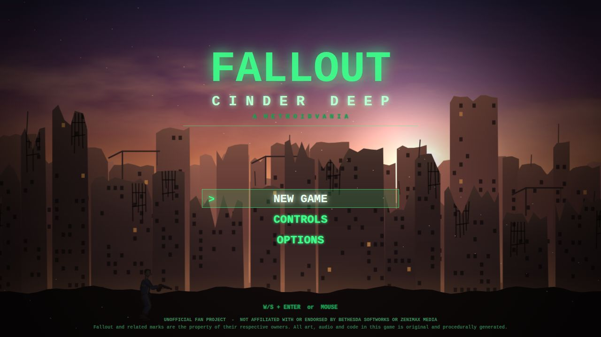

| | |
|---|---|
| 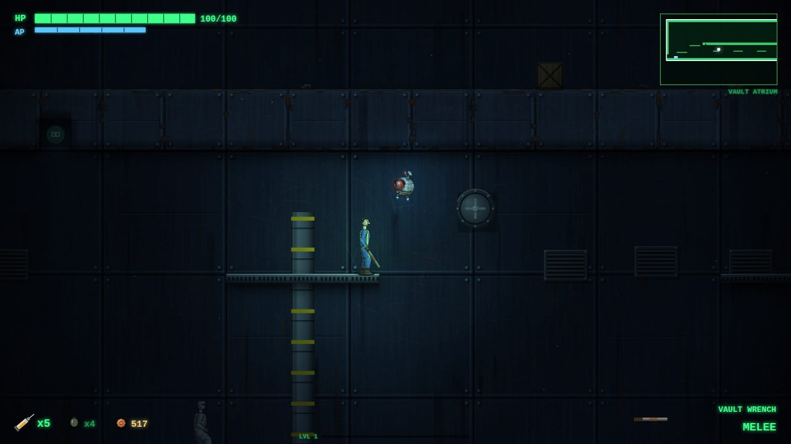 | 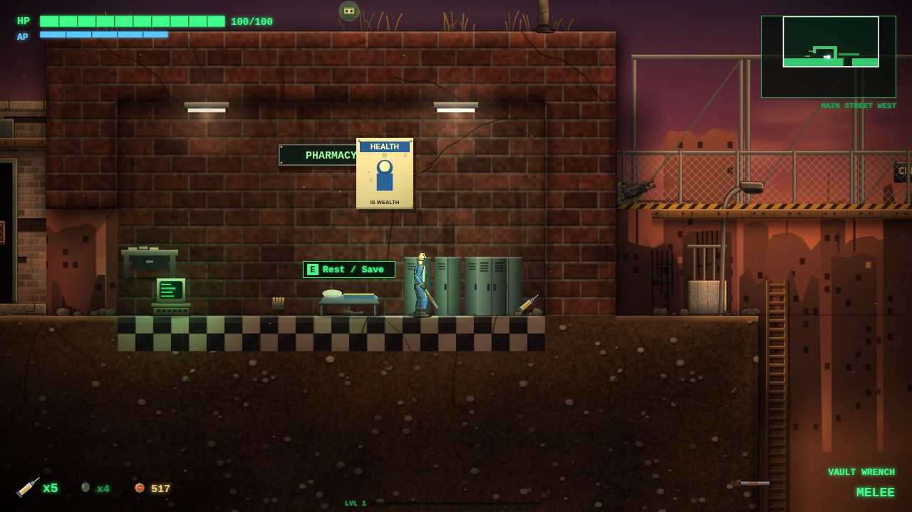 |
| 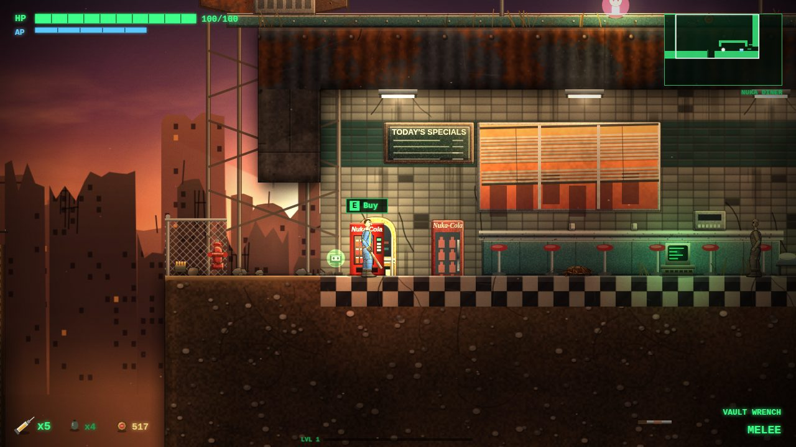 | 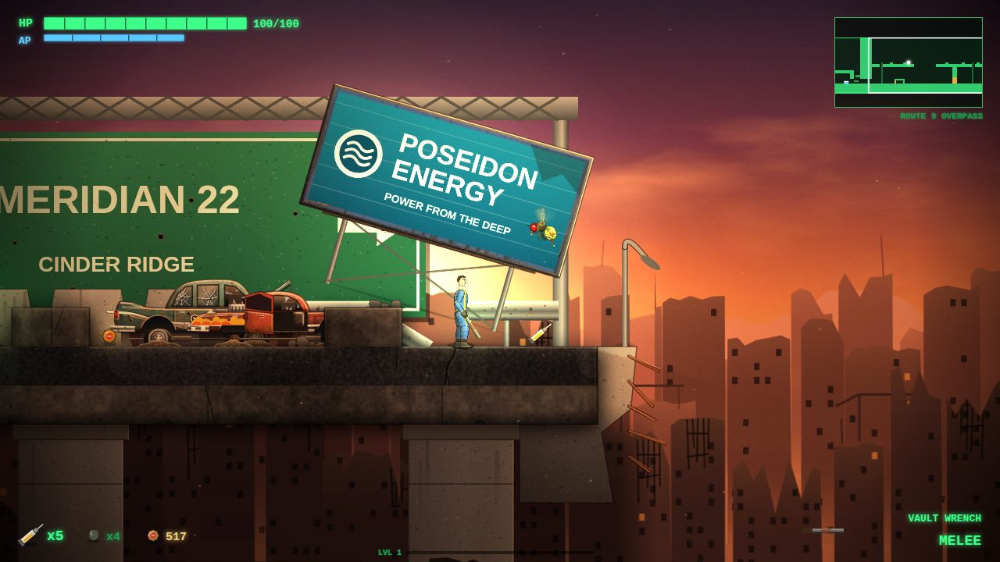 |
| 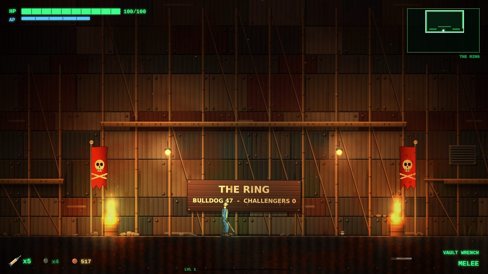 | 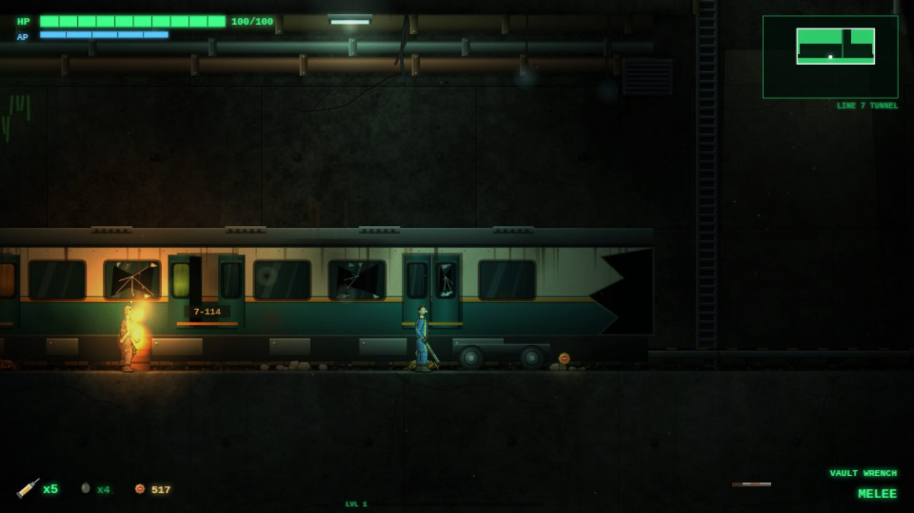 |
| 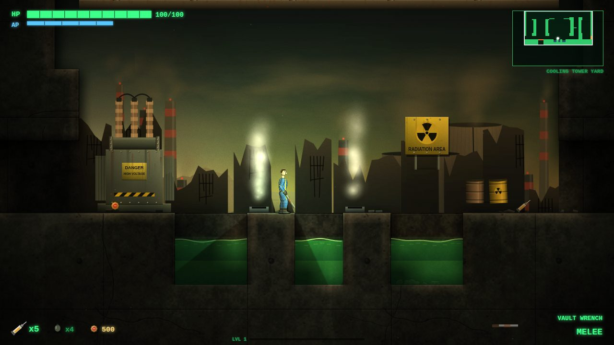 | 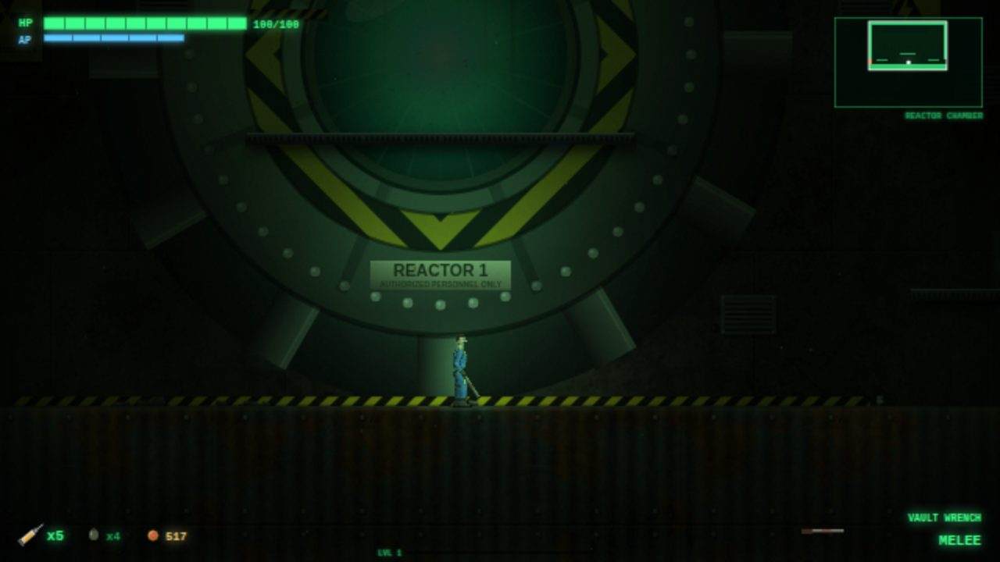 |
| 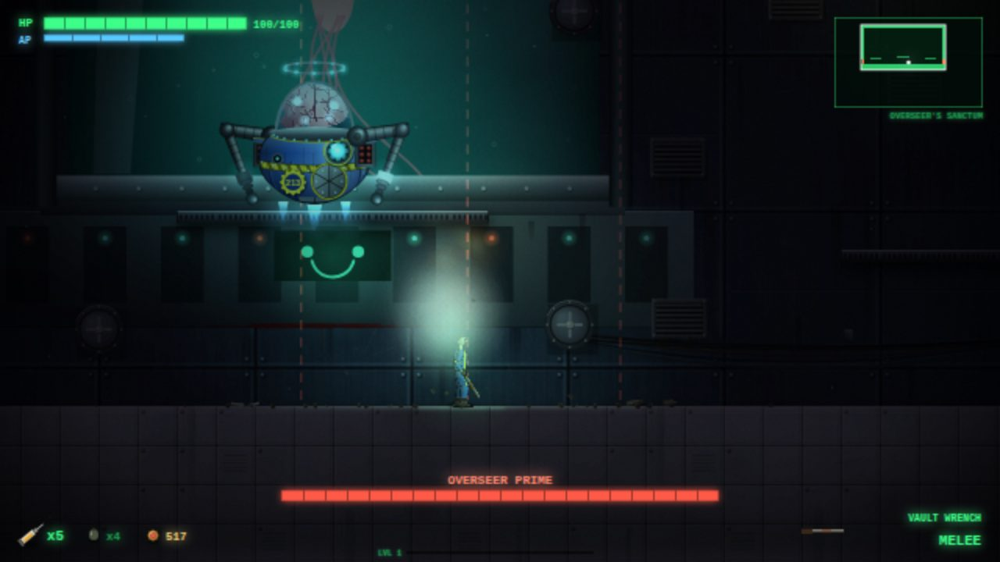 | 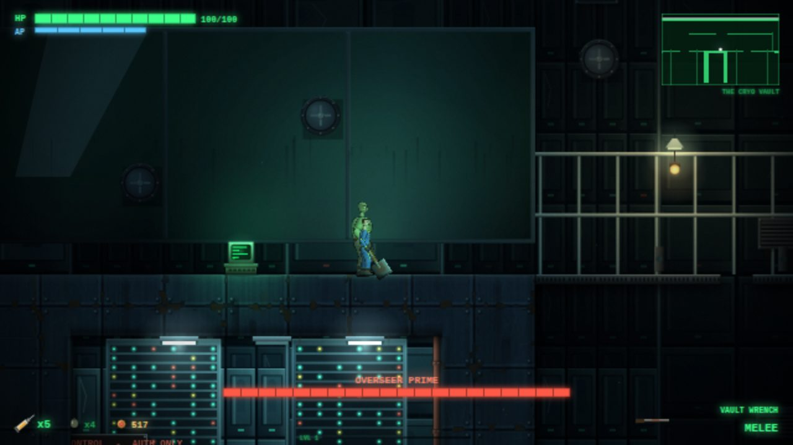 |

*(Screenshots are captured straight from the game by `tests/readme_shots.js`.)*

---

## Running it

* **Single file:** open `dist/fallout-cinder-deep.html` in a modern desktop browser (Chrome, Edge, Firefox, Safari). It works from
  `file://`. Rebuild it with `node tools/build.js`.
* **From source:** open `index.html`. The scripts load in the order listed in `src/manifest.js` (no bundler, no module loader).
* Click the canvas once (browsers only start audio after a click or key press).
* The game saves to your browser's `localStorage`. Beds (bunks) are save points **and** fast-travel points.

Query parameters for testing: `?start=1` (skip the title), `&room=<id>` (start in a room), `&abilities=all`, `&kit=1` (starter gear),
`&god=1` (nothing can hurt you), `&debug=1`.

## Controls

| Key | Action |
|---|---|
| `A` `D` / arrows | Move |
| `Space` | Jump (press again in mid-air with **Jet Boots**) |
| `W` / `S` | Aim up / crouch, climb ladders |
| Mouse | Aim |
| Left click / `J` | Shoot |
| Right click / `K` | Melee |
| `Shift` / `L` | Dash (**Jet Rush**, once per jump) |
| `E` | Interact (terminals, doors, bunks, vending machines, people) |
| `Q` | Stimpak |
| `R` | Reload |
| `G` | Throw grenade |
| `1`-`9`, `T`, `Y`, mouse wheel | Switch weapon |
| `V` | **V.A.T.S.** (slow-motion targeting) |
| `Tab` / `M` | Pip-Boy (status, items, data, map) |
| `Esc` | Pause |
| `N` | Toggle sound |

Gamepad: left stick move, A jump, right trigger shoot, X melee, B dash, Y interact, LB stimpak.
Touch devices get an on-screen stick and buttons automatically.

## What is in it

* **Seven areas, 56 rooms** on one continuous map: Vault 213, Cinder Ridge (the surface town), the Rustyard raider fort, the Meridian
  Metro, the East Ridge and Brotherhood crash site, the Meridian Power Station, and Cinder Deep.
* **Metroidvania progression.** Jet Boots (double jump), Gecko Grips (wall jump), Jet Rush (air dash), Power Fist (breaks cracked
  walls), Hazmat Suit (survive the irradiated coolant), plus keycards and terminals that unlock doors. Sequence-breaking is possible,
  but the intended route is gated by these.
* **Six bosses:** the Vault Warden, Bulldog the Warlord, the Glowing One, the Deathclaw, Sentry Bot Warden-9 and Overseer Prime, each with its own arena, attack patterns and phases. The arena gates stay shut until the boss dies, so every boss drops a resupply (ammo for your equipped gun, a stimpak) when it drops to 2/3 and 1/3 health, and again every 25 seconds while you are completely out of ammo.
* **Fallout systems:** Pip-Boy, S.P.E.C.I.A.L. and perks, level-ups, RAD and RadAway, V.A.T.S., stimpaks, holotapes, hackable terminals,
  traders, dialogue trees, vending machines, bobbleheads, weapon upgrades, ammo types.
* **Three endings**, decided at the very last terminal.
* **Auto quality scaling** (Options -> Graphics Quality) so it stays smooth on modest hardware.

## How the graphics work

There are no images in the project. The look is built from code:

* Seamless procedural **material textures** (concrete, rusted metal, soil, lab tile, rock, scrap, asphalt) with wear, stains and cracks.
* Levels are tile grids. The renderer bakes them in cached 12x12-tile chunks with ambient occlusion, bevelled edges, depth shading
  and hand-placed **decor painters** (vehicles, machinery, signs, pods, reactors ...) drawn once per chunk.
* **Dynamic lighting** with shadow-casting lights, sky exposure, glows and a lightmap multiplied over the scene, then bloom, grain,
  vignette and per-region colour grading.
* Multi-layer **parallax backdrops** (dusk skyline, toxic power-station skyline) with drifting clouds.
* Characters are **skeletal rigs with IK** (walk cycles, weapon holds, recoil) drawn procedurally; big creatures and bosses are
  painted with baked, shaded parts plus per-frame moving pieces.

It aims at a gritty, lit, textured look rather than cartoon flat colours. It is still procedural art, so it reads as *stylised realism*,
not photography.

## Project layout

```
index.html            loader (dev)          dist/    single-file build (generated)
src/core/             utils, input, audio, game loop
src/gfx/              textures, chunks, lighting, backdrops, rigs, creatures, decor painters
src/world/            tiles, room DSL, world assembly, room definitions per region
src/game/             player, enemies, bosses, items, terminals, UI, story, save/load
tools/                world_check, reach (reachability solver), spawn_check, build, screenshot helpers
tests/                headless test scripts and dev sheets (Playwright + Chromium)
docs/WORLD.md         level-authoring guide (movement metrics, DSL, region interfaces)
```

### Developer tools

```
node tools/world_check.js --summary       assemble + validate every room (overlaps, border alignment)
node tools/spawn_check.js                 static QA: floating/embedded spawns, headroom, doors, arenas, holotapes
node tools/reach.js --thorough --certify [--edges out.json]
                                          progression solver (walks/jumps/wall-jumps/dashes/ladders, unlocking abilities, keys, doors and bosses to a
                                          fixpoint). --certify only accepts a jump/fall edge when tools/real_sim.js, a headless copy of the game's own
                                          Player controller, reproduces it (~10 min)
node tools/robust_edges.js out.json       rank the solver's jumps by how forgiving they are (start offset / timing jitter through the real controller)
node tools/build.js                       single-file build -> dist/fallout-cinder-deep.html
node tests/room_shots.js <dir> --region plant --zoom 0.5     screenshot rooms (headless Chromium via Playwright)
node tests/t_real_boss.js overseer d_sanct 40     play a boss fight in its real arena room
node tests/t_sweep.js 4                   enter every room, play 4 s of random input, report exceptions / NaN positions
node tests/t_flows.js | t_mouse.js | t_pipboy.js | t_actions.js | t_interact.js | t_ending.js
                                          UI and gameplay flows driven with REAL key / mouse events (menus, Pip-Boy, dialogue,
                                          terminals, elevators, ladders, all three endings ...)
node tests/t_chimney.js s_ridge 640 56 30 both jetboots,gecko
                                          wall-jump bot: hugs a wall and taps Jump like a player would; proves a Gecko Grips shaft is climbable
node tests/t_gap.js --room s_over --edge 567 --far 581 --row 44 --abil jetboots,jetrush
                                          gap bot: sweeps jump / double-jump / dash timings and reports how many cross (and that none cross
                                          without the gating ability, use --want none)
node tests/t_crosscheck.js out.json 80 14   headless controller vs the browser game: same key frames, same landing cells (78/80 identical, the 2 differences are doors/cracked walls)
node tests/t_touch.js                     touch screen emulation: on-screen controls appear and the JUMP button works
node tests/t_warden.js                    the first boss with REAL triggers, mouse aim and key fire, 10mm pistol only: kill it, take the keycard, walk out
node tests/t_swim.js p_flood "846,123.5 849,110 ..." 841,123.5      waypoint swimmer for flooded rooms (Hazmat)
```

Those real-input tests earlier caught bugs that direct API calls hid (endings never starting, Pip-Boy Q/E and menu mouse clicks dead,
elevators not carrying the player, running left accelerating without limit, air bubbles that broke swimming), so extend them when you add UI or
interactables. The reachability solver (`tools/reach.js`) mirrors the player controller's rules (cling only while `vy > -80`, cling refills the
air jump, kick steering lock, speed carry after a dash) and starts every jump from a standstill, so it is deliberately a little pessimistic; the
bots above then confirm the ability-gated climbs and gaps with the real controller.

`tests/dev_*.html` are art sheets (decor kinds, bosses, creatures, rigs, textures) for looking at painters in isolation.

## Honest notes

* Everything was verified headlessly: level validators, a progression solver whose jumps are replayed through a headless copy of the game's own
  player controller (the whole 56-room route, all six bosses, every ability, key and terminal is reachable that way), wall-jump / dash / swim
  bots that use the real controller, scripted boss fights with real triggers, real-input UI tests and screenshots. It has **not** had a full human
  playthrough, so expect balance rough edges (enemy damage, ammo, prices), and please report them. Gamepad support was not tested at all.
* **Audio is procedural (WebAudio)** and was checked numerically (levels, clipping, balance), not by ear.
* Headless software rendering is slow; on a real GPU-backed browser the game runs at full speed.

## License

The code in this folder is provided as-is for personal, non-commercial use. See the fan-project notice above regarding the Fallout
name and universe.
