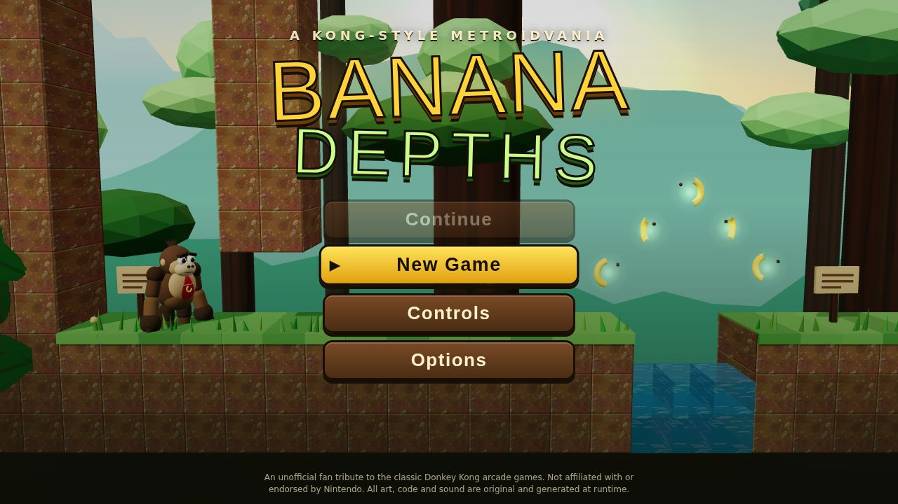
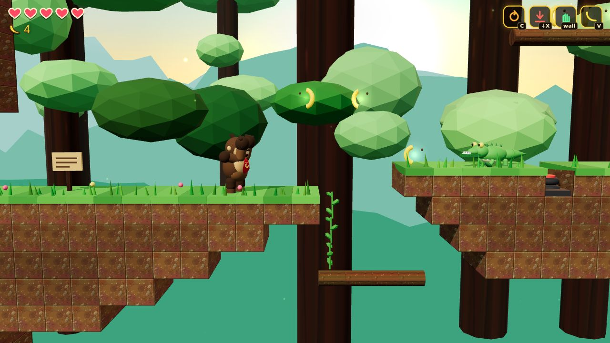
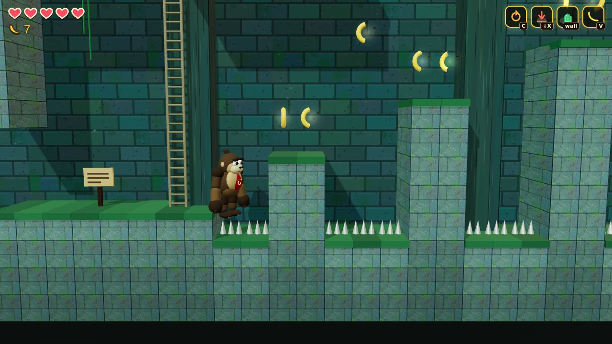
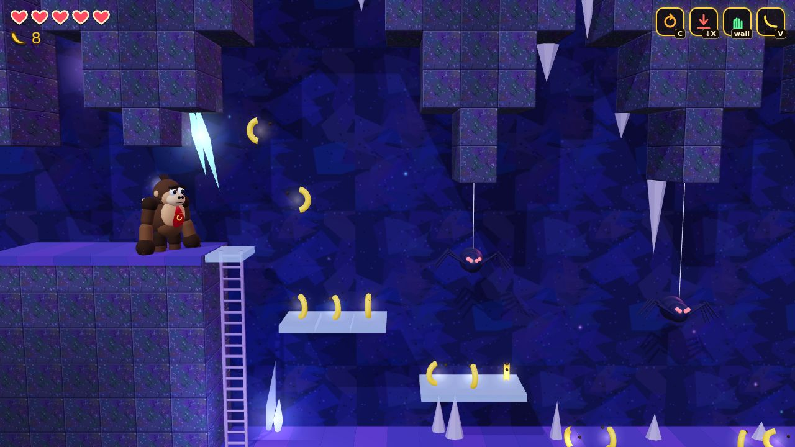
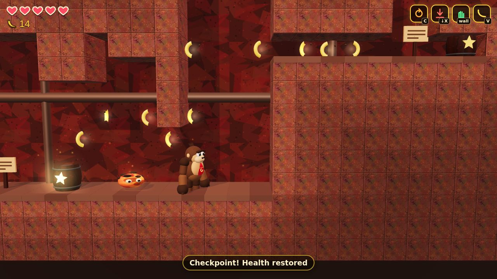
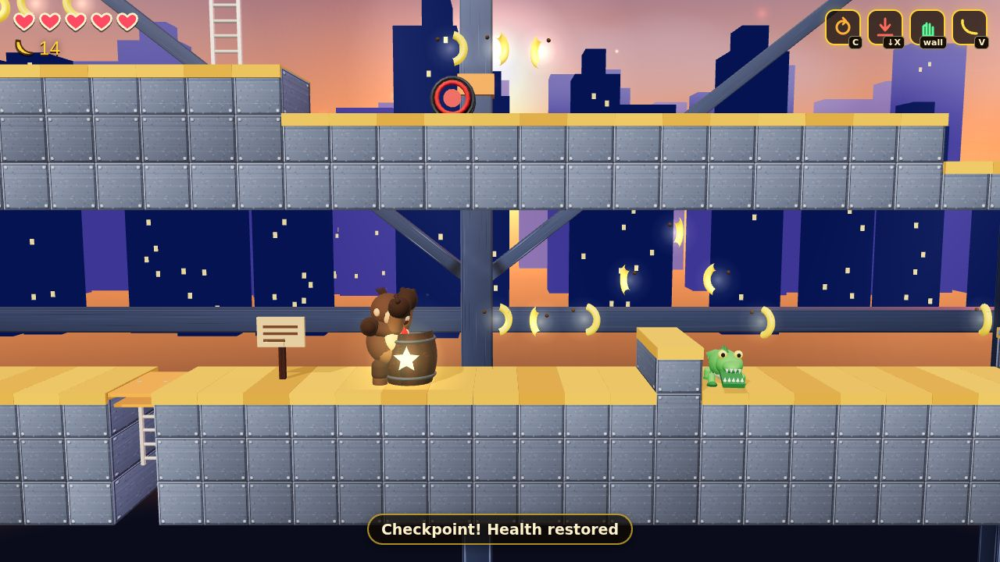
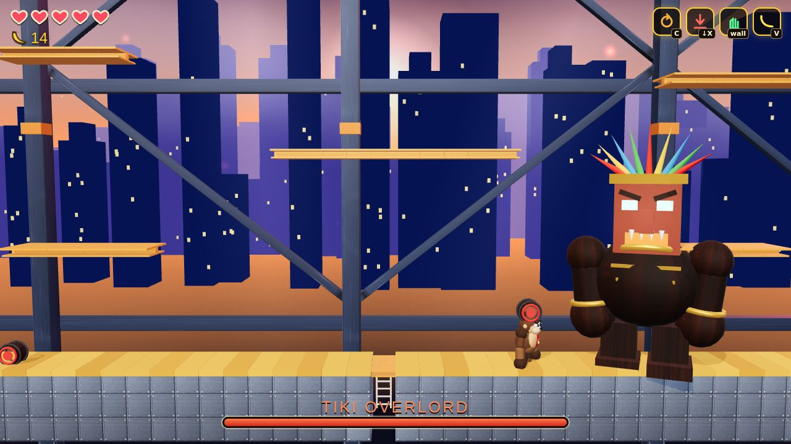

# Banana Depths

A fully 3D, side-scrolling **metroidvania** in the spirit of the classic barrel-chucking gorilla arcade games.
You play a gorilla in a red tie who sets out to bring the stolen Golden Banana back to the Jungle Heart,
pushing down through jungle, temple, crystal caverns and a lava quarry, then climbing the girder tower at
the end of the world.

It runs entirely in the browser: one self-contained HTML file, no downloads, no external assets.
Every model, texture, sound effect and music track is generated by code at startup.

> Unofficial fan tribute to the classic Donkey Kong arcade games. Original code and original (procedural) art and
> audio; no Nintendo assets or characters are used. Not affiliated with or endorsed by Nintendo.



| | |
|---|---|
|  |  |
|  |  |
|  |  |

Screenshots come from `node tools/screens.mjs`.

## Play

Open `dist/index.html` in any modern browser (WebGL 2 required), or:

```bash
cd games/banana-depths
npm install
npm run serve        # http://localhost:8080
```

`dist/artifact.html` is the same build as an embeddable fragment. Options (pause menu or title screen) has volume,
music, screen shake and, where the browser allows it, fullscreen. On phones and tablets the on-screen controls
appear in landscape.

## Controls

| Action | Keyboard | Gamepad | Touch |
|---|---|---|---|
| Move / climb ladders and vines | Arrows or WASD | Left stick / D-pad | Left pad |
| Jump (hold for height) | Space, Z or K | A | JUMP |
| Slap (also pops barrels) | X or J | X | SLAP |
| Roll | C, Shift or L | B / bumpers | ROLL |
| Banana Boomerang | V or I | Y / triggers | BOOM |
| Pause | Esc or P | Start | pause icon |
| Map | M or Tab | Select | map icon |

Moves you unlock along the way:

* **Roll** (Jungle): tuck into a ball. Smashes crate walls (`R`), squeezes through one-tile tunnels,
  and a roll-jump carries you over wide gaps.
* **Ground Pound** (Temple): press Down + Slap in the air to crash through slab floors and stun nearby enemies.
* **Gorilla Grip** (Caverns): cling to walls and wall-jump up tall shafts. Hold toward the wall and press Jump.
* **Banana Boomerang** (Quarry): flies a few tiles, hits far-away crystal switches and picks up distant bananas.

Everything else: stomp or slap enemies, bounce on springs, ride ladders and vines, and avoid spikes, lava and water.
You start with 3 hearts; each of the 9 hidden Heart Fruits adds one. Collect 50 bananas for a free heal.
Barrels with a sparkle are save points; progress is stored in `localStorage` (Continue on the title screen).

## The world

26 rooms in five areas, joined into one map (press M):

| Area | Abilities you have | Learned here | Boss |
|---|---|---|---|
| Jungle (6 rooms) | none | Roll | none |
| Temple (5 rooms) | Roll | Ground Pound | Stone Golem |
| Caverns (6 rooms) | Roll, Pound | Gorilla Grip | Crystal Spider Queen |
| Quarry (3 rooms) | Roll, Pound, Grip | Banana Boomerang | none |
| Tower (6 rooms) | all four | none | Tiki Overlord, then the Golden Banana |

745 bananas, 9 Heart Fruits, 4 ability relics and 3 bosses. Boss doors open when the boss falls. Each boss has a tell
and a short window where it can be hurt; the Tiki Overlord is beaten by slapping his own barrels back at him.
Every room's main path needs only what you own at that point. The secrets (visible crate walls, slab floors,
tall shafts and far-away switches) are there to pull you back once you have learned the move that opens them.

## How it is built

* **Three.js** for 3D, bundled with esbuild into a single HTML file (`scripts/build.mjs`).
* A fixed 60 Hz simulation with interpolated rendering. The platformer physics (`src/sim/physics.js`) is DOM-free,
  so the exact same code runs in the game and in the headless solver.
* **Procedural everything**: canvas-drawn textures, primitive-built models, WebAudio synthesis and a step sequencer
  for the music (`src/gfx`, `src/core/audio.js`).
* Rooms are authored as ASCII grids with markers for enemies, pickups and props (`src/world/builder.js`,
  `src/world/rooms/*.js`); the engine decorates each area's theme automatically. The format is documented
  in [`docs/WORLD_SPEC.md`](docs/WORLD_SPEC.md).
* Adaptive quality: the renderer lowers its internal resolution if the frame rate drops
  (`?lowq` and `?noshadow` force lighter settings).

## Dev tools

```bash
npm run build          # dist/index.html + dist/artifact.html   (node scripts/build.mjs --dev: readable bundle in .cache/dev.html)
npm run test           # physics + solver unit tests (no browser needed)
npm run verify         # whole world, stage by stage: every ability gate, every item, the Golden Banana
node tools/room-report.mjs --area=quarry --abil=roll,pound,grip --png --margin
node tools/ghost.mjs                       # replays the solver's routes through the real game engine
node tools/arrival-lint.mjs                # no enemy or hazard near any portal arrival
```

`tools/solver.mjs` is a reachability solver that replays the real player physics over macro-inputs (run, jump,
roll, wall-jump, ...) to prove that a room can be crossed with a given set of abilities, and that gated areas
really are blocked without them. `--margin` re-checks with slightly weakened physics so nothing depends on
frame-perfect play. `verify-world` runs it room by room in the order a player would, and `ghost` then takes the
exact inputs behind every route and feeds them through the real game loop in headless Chromium, so a mismatch
between the solver's physics model and the game (crumble blocks, springs, ladders) shows up as a failed replay.

Browser tests (`node tests/<name>.mjs`, need Playwright and Chromium) drive the real game:

| Test | What it checks |
|---|---|
| `flow` | boot, title, new game, pause, map, save and continue, death and respawn |
| `scenarios` | 19 combat cases: stomp, slap, roll, ground pound, boomerang, every enemy |
| `mechanics` | save barrels, heart fruit, signs, crystal gates, crumble blocks, portals, ladders, crates that stay broken |
| `boss-bot` | a scripted bot must be able to kill all three bosses |
| `world-smoke` | arrive through every portal of every room: alive, unhurt, in the room |
| `portal-bounce` | jumping through a top portal can never bounce Kong back through the matching bottom one |
| `ending`, `audio-smoke`, `artifact-wrapped` | the ending cinematic, all sound effects and tracks, the embedded build |

## Credits

All code, art and audio are original and generated procedurally. The only runtime dependency is
[Three.js](https://threejs.org/) (MIT), which is bundled into the build; the title screen loads
two Google Fonts and falls back to system fonts when offline.
## Credits

All code, art and audio are original and generated procedurally. The only runtime dependency is
[Three.js](https://threejs.org/) (MIT), which is bundled into the build; the title screen loads
two Google Fonts and falls back to system fonts when offline.
