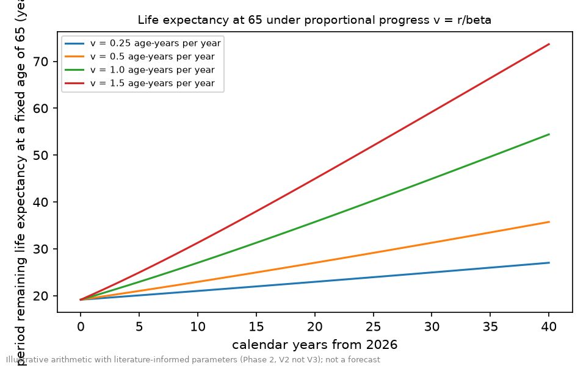
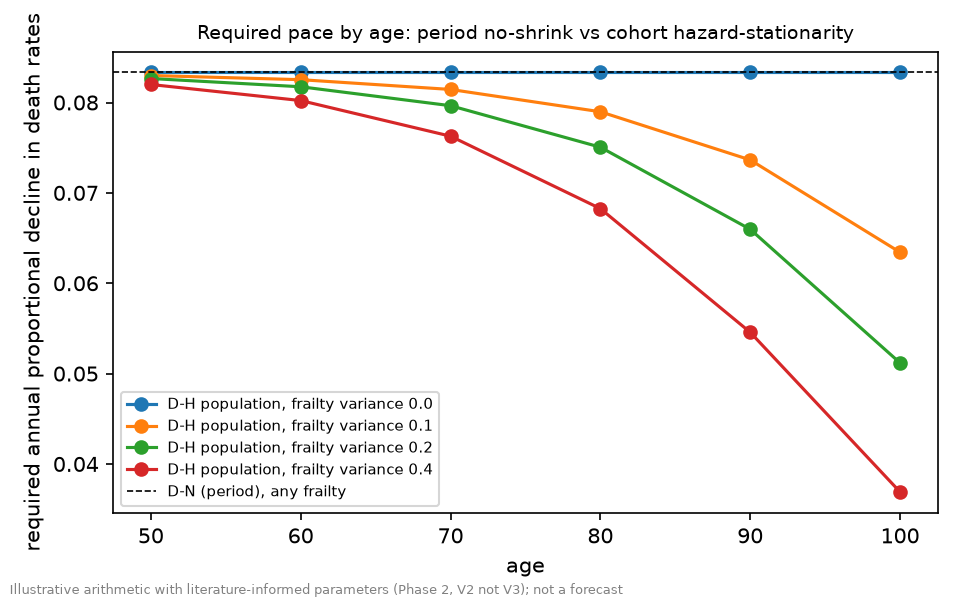
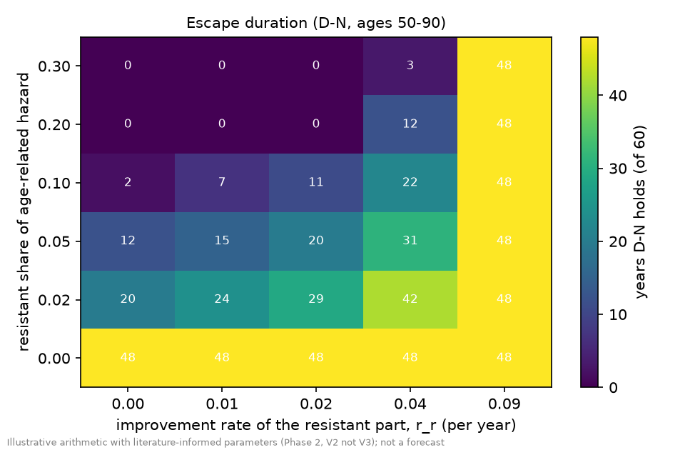
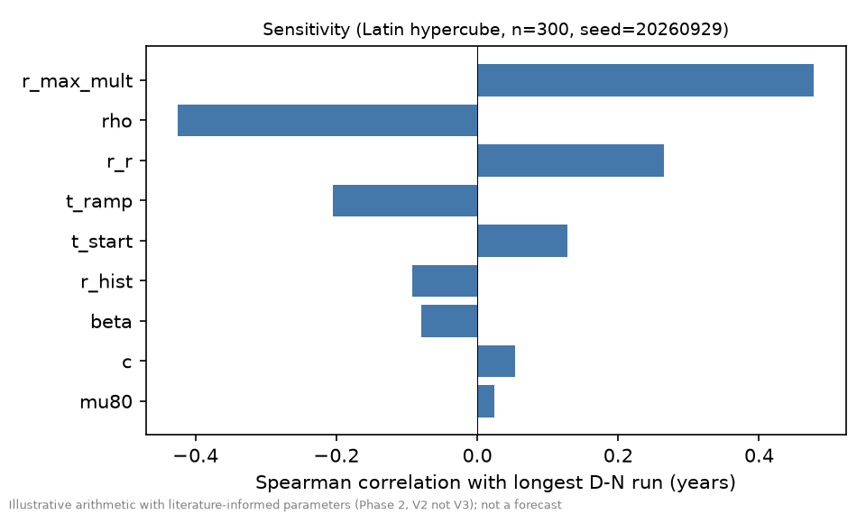
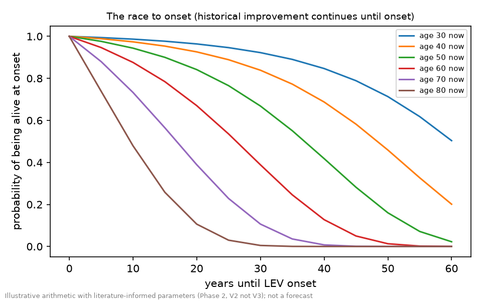

# Longevity Escape Velocity: What It Would Take, How Far the Evidence Says We Are, and What Can Be Said About When

**A preliminary deep-research report (draft v3, revised after two rounds of review)**

| | |
|---|---|
| Run | `deep-research` v2.12.1, `full` mode. Phases 1-6 complete: scoping, investigation, analysis, report, four reviews of draft v1 (editorial, ethics, devil's advocate, claims audit), a revision (draft v2, commit `7735418`), a verification round by the same four reviewers, and a second and last revision (this draft, v3). Draft v1 is commit `fc40bde`; the reviews and their dispositions are in `phase5_review/`. |
| Date | 2026-09-29 (search date for all evidence) |
| Question | Under what conditions, and by what dates if any, does the evidence support the arrival of longevity escape velocity (LEV) in human populations? |
| Status | **Preliminary.** Evidence collection stopped early when the session's shared web-search cap was reached. Every figure comes from search summaries, not primary texts. Some figures were present in the search queries themselves (marked †). The independent re-verification the plan required did not run (§2, §7). |
| AI disclosure | Produced entirely by AI agents. They searched the web, graded the evidence, wrote and tested the model code, drafted this text, and reviewed it. All roles are the same model family, so fresh contexts reduce anchoring, not shared blind spots. **No human has checked any figure, citation or calculation.** Not medical, financial or legal advice. |
| Scope | High-income populations with US-like mortality. The evidence on demand, cost and access is mostly from the United States (8 of 12 economics-and-attitudes cards) and none is from a low- or middle-income country. Individual-level results assume full access to any treatment. |

**How to read the labels.** `[ESTABLISHED]` replicated findings or definitional mathematics. `[SUPPORTED]` consistent evidence, limited replication, or animal-only. `[CONTESTED]` credible sources disagree. `[SPECULATIVE]` reasoning without direct evidence. `[AUTHOR-JUDGMENT]` the AI-generated structured judgment behind this report, low confidence. **Evidence levels** are in the reference list: **V2** = existence confirmed at a primary source plus one attributing sentence in a search summary; **V2-P** = the party's own claim about itself (the text says "reported by the company" or similar); **V1** = secondary sources only, a pointer and not a finding (the text says "secondary sources only"). **No figure reached V3**, except one claim-level convergence (smoking cessation, two independent studies). **†** marks a figure that was present in the search query, so the summary repeating it is not independent confirmation. **‡** marks a reference detail supplied from background knowledge (§7). Where the search results did not show authors, the text cites the evidence card (for example "card W8-01"); the card files are in `phase2_investigation/`.

---

## 1. The short answer

**Bottom line.** LEV is the state in which medicine extends a person's remaining life expectancy at least as fast as they age. That takes about one *age-year* of progress a year (3 age-years means the death rates of someone 3 years younger). On the frozen "no-shrink" definition, death rates must fall about 8% a year at every age from 50 to 90, against 1-2% observed: 4-8 times faster. A cohort reading needs about 4-8% at ages 50-80 and the popular "one year per year" reading 8-17%, so the gap is 2-17 times across definitions (§3). No human intervention reviewed can close it; the evidence cannot say when, or whether, that will happen.

**How far.** The best-demonstrated human effects on all-cause mortality are one-off shifts of 1-5 age-years (blood pressure, statins, an SGLT2 inhibitor), so LEV would need a new one every 1-5 years. If mouse lifespan gains transferred in full (an upper bound, not a finding), a 20-age-year effect every 20 years would give the average pace, but the annual criterion needs steadier delivery. No intervention presented as targeting ageing has shown a human mortality benefit in the programmes reviewed (§4).

**When.** The evidence cannot separate stagnation, acceleration short of LEV, onset by 2060 and later onset. Onset by about 2035 would need the pace to climb from 1.5% to about 8% a year within about nine years; I judge that unsupported `[AUTHOR-JUDGMENT]`. Later dates are conditional: neither "not this century" nor "by 2060" is contradicted. No probability is offered (§5).

**How.** Large, repeatable, stacked all-cause human effects; the brain covered; a fast regulatory route; near-universal access; public acceptance (§5.3).

**Individuals.** Age at onset matters most; the best-evidenced levers are ordinary prevention (§6). Confidence: high in the arithmetic, low to moderate in the empirical anchors, low in dates.

---

## 2. Question, definitions, and method

**Question.** Under what conditions, and by what dates if any, does the evidence support the arrival of longevity escape velocity, as formally defined, in human populations? "If any" keeps "not this century" a live answer.

**Definitions.** Life-expectancy language hides several different criteria. Three were frozen before the search (`phase1_scoping/03_analysis_plan.md`); the cohort criterion was added after review and is logged as a deviation (plan §13). Let μ be the death rate at an age and e the remaining life expectancy.

**Table 1.** The criteria

| Label | Condition | What it means |
|---|---|---|
| **D-N** (primary, "no-shrink") | e(x+1, t+1) ≥ e(x, t) at every age from 50 to 90, for at least 20 consecutive years, on period life tables | A person one year older, one year later, has at least the remaining life expectancy they had. Under standard mortality it needs progress of one age-year per calendar year at every age (v ≥ 1). |
| **D-1, period** ("one-for-one") | e(x, t+1) ≥ e(x, t) + 1 on period tables | Needs v ≥ 1/(1 − μe): about 1.15 at 50, 1.4 at 65, 2.0 at 80. Popular statements of LEV read like this. |
| **D-1, cohort** (added in review) | The remaining life expectancy of a cohort at a fixed age, counting the improvement that cohort will itself experience, rises by at least 1 year per year | About half the period D-N pace at young ages (§3). |
| **D-H** ("hazard stationarity") | The death rate a person faces stops rising as they and calendar time advance | Coincides with D-N under simple mortality; diverges under heterogeneity (§3). |

**Age-years and pace.** A one-off proportional cut in death rates to a fraction *k* is worth g = ln(1/k)/β age-years, where β ≈ 0.087 a year is the Gompertz slope (death rates double about every 8 years). A sustained proportional decline at log-rate *r* is a pace *v* = r/β age-years per calendar year. Percentages per year in this report are proportional annual declines (1 − e^−r) unless called log-rates.

**Method.** A structured evidence review over three linked sub-questions (requirement, gap, closure); a transparent demographic model with committed, tested code (34 unit tests); a competing-hypotheses analysis over four outcomes fixed in advance (**O1** stagnation; **O2** acceleration short of LEV; **O3** LEV with onset by 2060; **O4** LEV with onset 2061-2100); reference classes fixed in advance; and adversarial review at scoping (three rounds: revise, revise, then pass on a spot check) and on this report (four reviews of draft v1, then a verification round by the same four reviewers; all one model family).

**Evidence base and its limits.** Seven search workstreams and a coordinator supplement (W8) produced about 130 evidence cards. All were searched on 2026-09-29 through a tool that returns a list of links and a model-written summary. Direct access to scholarly sites (Crossref, PubMed, publishers, registries) was blocked by the environment's network policy, and the workstreams' shared 200-search cap ended collection early. No card reaches figure-level corroboration (V3) except the smoking-cessation claim. The independent re-verification the plan required could not run, and the coordinator's supplement is not independent. Every figure below is **summary-mediated**.

**Query-seeded figures (†).** Some searches carried a figure in their own text, so the summary's echo is not confirmation. The claims audits found more of these than the draft had marked. They include the pace anchors (1-2% and 1.5% a year), the doubling time of about 8 years, the anti-amyloid effects (27% and 35-36%), the +36% remaining-lifespan senolytic figure, the acarbose and canagliflozin lifespan gains (which also appeared, unattributed, in a query that did not carry them), the Alzheimer's-trial success rate of 0.4%, the 115-year limit attributed to Vijg, the wording "early 2030s" attributed to Kurzweil (also logged under a query that did not carry it), the limit ages of 65 and 85 in RC1, the record-trend figure of 2.5 years per decade, the count of nine men in the thymic study, and the drug-history dates 1987, 1994, 1992 and 2005 (Table 11 note). (The +24-27% senolytic figure came from a patent-family or abstract source, not a primary text.) They were not independently retrieved here, so the gap rests on inputs that are plausible but not verified.

**Model inputs.** Table 2 lists the inputs that drive the tables and figures, with their sources and status; the machine-readable set is `phase3_analysis/model/params.json`, with defaults in `run_analysis.py`.

**Table 2.** Model inputs

| Input | Value used | Range | Source and level | Status |
|---|---|---|---|---|
| Gompertz slope β | 0.087 (doubling about 8 years) | 0.069-0.099 (7-10 years) | Card W8-01† (Gompertz-law articles in the search results) | Ranged, not corroborated |
| Age-related death rate at 80, μ(80), 2026 | 0.05 | 0.035-0.070 | Placeholder, fixed in the plan before any comparison with data; the model's e(65) of 19.1 years is a plausibility check against the OECD average of 19.9 in 2019 (Organisation for Economic Co-operation and Development [OECD], n.d.) | **Placeholder** |
| Extrinsic floor c (deaths that do not age) | 0.0004 | 0.0002-0.0010 | None | **Placeholder** |
| Historical decline r_hist | 1.51% log-rate (1.5% a year) | 1.0-2.0% | CMI assumption† and NBER range† (§4.1) | Ranged |
| Age band; window | ages 50-90; 20 consecutive years | plan | Frozen plan | Definition |
| Ramp used in illustrations | linear over 20 years to 1.5β (Table 9), or to 1.3β or 1.5β over 5-40 years (Tables 14 and 17) | 5-40 years | None (illustrative) | Illustrative |
| v_hi (pace above which "acceleration short of LEV" is scored) | 0.30 age-years a year (about 2.6% a year) | 0.20-0.40 | **Team-set upper bound** (plan §13): the decade-by-sex tables that would fix it were not retrievable | Team-set, not measured |
| Human lifespan L used to convert animal gains (Table 8) | 80 years | not varied | Convention (plan §7) | Assumption |
| Frailty variance σ² (frailty extension; Figure 2, T1d) | 0.1, 0.2 and 0.4 | 0.1-0.4 | None; illustrative, not evidence-based | Illustrative |
| Overlap between successive effects (Table 6) | 0%, 25% and 50% | 0-50% | None (illustrative) | Illustrative |
| Other sampled inputs (Monte Carlo, Figure 4) | resistant share 0-30%; its improvement rate 0-4% a year; final pace 0.5-2.0 times the threshold; ramp 10-40 years; start delay 0-20 years | as stated | None (illustrative) | Illustrative |

The tables and figures are illustrative arithmetic on these inputs. They are not forecasts.

---

## 3. What LEV requires (sub-question 1)

**The arithmetic.** Adult death rates rise roughly exponentially with age, doubling about every 8 years (card W8-01†; a range of 7-10 years is used). If death rates at every age fall by a fixed proportion each year, remaining life expectancy at any age moves as if people were getting younger by v = r/β age-years per calendar year. Solving for the point where it stops shrinking gives the required decline (Table 3).

**Table 3.** Required annual decline in death rates, by criterion (model outputs T1 and T1c)

| Doubling time | β | Period D-N | Cohort D-1 at ages 50 / 65 / 80 / 90 | Period D-1 at ages 50 / 65 / 80 / 90 |
|---|---|---|---|---|
| 7 years | 0.099 | 9.4% | 5.2% / 5.9% / 7.8% / 10.4% | 10.4% / 12.0% / 16.9% / 25.0% |
| 8 years | 0.087 | 8.3% | 4.7% / 5.4% / 7.1% / 9.2% | 9.5% / 11.2% / 15.7% / 22.3% |
| 9 years | 0.077 | 7.4% | 4.4% / 5.1% / 6.5% / 8.3% | 8.8% / 10.5% / 14.7% / 20.3% |
| 10 years | 0.069 | 6.7% | 4.1% / 4.7% / 6.1% / 7.5% | 8.3% / 10.0% / 13.9% / 18.8% |

`[ESTABLISHED]` as definitional mathematics for the period criteria (verified analytically and numerically). The cohort figures are numerical: a reviewer's separate scratch code (same model family) and the committed model agree, they assume no frailty, and varying the placeholder floor from 0.0002 to 0.0010 moves them by at most 0.2 percentage points at ages 30-40 and by 0.1 or less from age 65. At low hazard and no floor the cohort threshold tends to β/2 (the gain is r/(β − r)); this is tested analytically.

**Which is "the" threshold depends on the question.** Period D-N asks whether a person a year older, a year from now, is no worse off on that year's tables. Cohort D-1 asks whether each successive cohort of the same age expects a full extra year, counting the progress it will still see. The report's headline is the frozen primary, period D-N (about 8%). The cohort range is a post-review addition. It is about half as demanding at young ages, rises with age, and passes period D-N at about age 85 (9.2% against 8.3% at 90 for the 8-year doubling time). At age 50 the order is cohort D-1 (4.7%), then period D-N (8.3%), then period D-1 (9.5%); period D-1 rises much faster with age (15.7% at 80, 22.3% at 90). Against an observed 1-2% a year, the acceleration required is about 3-9 times on period D-N (4-8 times at the central slope), about 2-8 times on cohort D-1 at ages 50-80 (2.4-7.1 times at the central slope), and about 4-17 times on period D-1 at ages 50-80. The popular view that "one year per year" is stricter than "no-shrink" holds on period tables, and on cohort tables only above about age 85. **On every reading the pace must rise several-fold; only the multiplier depends on the definition.**

**Figure 1.** Model period life expectancy at age 65 by calendar year for constant paces v = 0.25, 0.5, 1.0 and 1.5 age-years a year (`F1_e65_by_v.png`). At v = 1 life expectancy at a fixed age rises by 1 − μe, about 0.7 years per calendar year at 65, which is why the popular "one year per year" needs a pace above 1.

**An extrinsic floor does not lower the threshold.** Deaths from causes that do not age (accidents, violence) neither raise nor lower the required pace; they cap expected remaining life at about 1 divided by their rate, however far ageing is defeated. `[ESTABLISHED]` (a first draft of the plan said otherwise; a numerical check corrected it before any result was produced, and the correction is logged).

**Escape is not survival.** At the moment D-H is reached the death rate stops rising but does not fall. Expected remaining life after onset is about 1 divided by the death rate then. At today's placeholder mortality that is about 20 years for someone who is 80 at onset, and about 27 years if death rates first fall 1.5% a year for 20 years (model outputs T5). Long expected lifetimes need the decline to continue beyond the threshold, and their size depends on the extrinsic floor, which is a placeholder. The report therefore quotes no "thousand-year" figures. `[ESTABLISHED]` (arithmetic); `[SPECULATIVE]` (any specific lifetime).

**Heterogeneity and the threshold's shape.** When people differ in frailty, the population's death rate rises more slowly at old ages (selection). Three consequences follow.

1. In the model's synthetic-cohort period convention the D-N threshold is about 8.3% at every age *by construction* (the whole period schedule just shifts in age). That is a property of the convention, not a finding. The population-level cohort-path criterion D-H falls with age (6.6% at 90 and 5.1% at 100 for frailty variance 0.2; 3.7% at 100 for 0.4), but that is a composition effect and does not lower what any individual needs.
2. Selection damps observed population declines relative to individual-level declines by a factor 1/(1 + σ²H): 0.90-0.82 at age 80 and 0.79-0.65 at 90 for σ² of 0.2-0.4 (T1d). If the true variance is in that range (it is not evidence-based here), individual-level declines could be 1.1-1.2 times the observed at 80 and 1.3-1.6 times at 90, so the observed-versus-required gap at the oldest ages is overstated by those factors.
3. "The same threshold at every age" assumes a constant Gompertz slope. In general the period D-N threshold at an age is at most the largest one-year log-slope of the death rate at that age and above (it is a survival-weighted average of the slopes ahead), so where the slope declines with age (as some data suggest, card W8-01) the threshold declines with it. A slope falling from 0.10 to 0.07 a year, for example, would cap it at about 9.5% at the younger age and 6.8% at the older (arithmetic from the slope, not a model run; a reviewer's scratch check with a falling slope gave lower values, 7.8% at age 50 falling to 6.4% at 90, which were not reproduced here). The binding age in the 50-90 band is then the youngest.

**Figure 2.** Required annual decline by age: period D-N (dashed) and population-level D-H under four frailty variances (`F5_threshold_by_age.png`).

**A discrepancy in the literature, and a candidate reconciliation.** A 2018 actuarial paper (Debonneuil et al., 2018) is summarised as saying that sustained mortality improvements of 4% "would also lead to LEV, but would need to start within a certain time to match announced probabilities" (cards W1-02, W8-08; the figure appeared in the summaries of three queries that did not carry it, all drawing on one abstract, as well as in two that did; whether it is per year, at all ages, and under which definition was not stated). That is about half the period D-N threshold. The cohort D-1 criterion gives 3.7-5.2% at ages 30-50 (Table 3 and T1c), which matches a 4% figure at young ages. Whether that is the paper's definition is `[SPECULATIVE]` until the paper is read. The report keeps the frozen definitions as its standard, shows both, and flags the gap.

---

## 4. How far we are (sub-question 2)

### 4.1 The observed pace

**Table 4.** Observed pace of decline in death rates (model output T2; the last column compares with the pace needed on period D-N, v = 1, and divides log-rates, so it differs a little from the ratios of annual percentages in §1 and §3)

| Source | Measure | Annual decline | Age-years per year (v) | Pace needed ÷ observed | Level |
|---|---|---|---|---|---|
| Continuous Mortality Investigation long-term assumption† (Institute and Faculty of Actuaries, n.d.) | an assumption ("not based on data") | 1.5% | 0.17 | 5.8× | V2† |
| All-age mortality since 1900† (National Bureau of Economic Research [NBER], 2002) | observed, all ages | 1-2% | 0.12-0.23 | 4.3-8.7× | V2† |
| Older ages, Western Europe, 1980s-90s† (National Academies Press, 2000) | observed | about 1% | 0.12 | 8.7× | V2† |
| US 2018 to 2019, ages 65-74 / 75-84 / 85+ (National Center for Health Statistics [NCHS], 2020) | single year | 1.0% / 1.8% / 1.7% | 0.12 / 0.21 / 0.20 | 8.7× / 4.8× / 5.1× | V2 |
| US ages 65 and over, crude, 2000-2019 (a statistics portal, card W8-04) | secondary source: about 1.4% | | | pointer only; not used | V1 |

`[SUPPORTED]` (the three anchor rows marked † are query-seeded, §2). These are old, all-age, single-year or assumption-type figures. The decade-by-sex tables the plan required (Human Mortality Database, Kannisto-Thatcher; see Rau et al., 2008, for the latter's use at ages 80 and over) were not retrievable, so the gap is a comparison of the model with a scatter of published rates, not with a fitted series. A single cause can move much faster: US age-adjusted coronary death rates fell about 3.3-3.5% a year for 20 years (3.4-3.6% as log-rates; v about 0.4; ages 25-84; Ford et al., 2007), and death rates in an advanced-HIV cohort fell about 41% a year for a little over two years after combination therapy (card W8-14: 29.4 to 8.8 deaths per 100 person-years, 1995 to mid-1997). No all-cause, all-age decline at that pace has occurred.

**Is progress slowing?** Sources disagree, and they measure different things. Record life expectancy at birth rose about 2.5† years per decade from 1840 (Oeppen & Vaupel, 2002), and Vaupel (2010) and Vaupel et al. (2021) argue the pace has been steady. Olshansky et al. (2024) report deceleration since 1990 in ten populations and conclude that radical life extension is implausible this century unless ageing is markedly slowed; their survival-to-100 projection (at most 15% of women and 5% of men) is the authors' own, from a single query with horizon and interval unstated (card W6-05). Andrade et al. (2025) forecast slower cohort gains, with over half of the slowdown from mortality under age 5. Bonnet et al. (2026) find that in Western Europe the 2005-2019 slowdown is associated with rising mortality at ages 55-74. A 2026 preprint questions whether the slowdown is real (Patricio & Baudisch, 2026). US death rates at 65 and over stopped falling as fast after about 2010 (NCHS, 2020). `[CONTESTED]`. Two cautions: life expectancy at birth is not an age-band hazard, and an age-10 or age-70 slowdown matters differently for LEV. Official projections have repeatedly under-predicted gains (Social Security Administration [SSA], 2005), and every published "limit" to life expectancy was broken, on average within about five years (Oeppen & Vaupel, 2002): an existence class, not a base rate (§5.2). The "steady" sources share a lead author, and the "deceleration" authors argue for a shift to geroscience: neither side is independent of its own thesis (card W1 conflict C5).

### 4.2 What medicine has demonstrated in humans: level effects, not a rate

Effects on all-cause mortality, converted to age-years (β = 0.087; the ranges for β of 0.069-0.099 are in `phase3_analysis/outputs/T3_effects_in_age_years.csv`).

**Table 5.** Human effects on all-cause mortality

| Intervention (source) | Kind | All-cause hazard ratio (95% CI) | Age-years, once |
|---|---|---|---|
| Intensive blood-pressure target, primary report stopped early, median follow-up 3.3 years (Wright et al., 2015) | trial | 0.73 (0.60-0.90) | 3.6 (1.2-5.9) |
| Same trial, "trial period" re-analysis (a conference-abstract supplement; attribution inferred; "Long-term mortality in the SPRINT cohort," 2024) | trial | 0.83 (0.68-1.00) | 2.1 (0-4.4) |
| Same trial including 8 post-trial years (same abstract) | trial, benefit not sustained | 0.96 (0.89-1.04) | 0.5 |
| Blood-pressure lowering, per 10 mmHg systolic (Ettehad et al., 2016) | meta-analysis | 0.87 (0.84-0.91) | 1.6 |
| LDL-cholesterol lowering, per 1.0 mmol/L (Cholesterol Treatment Trialists' Collaboration, 2010) | meta-analysis, 26 trials | 0.90 (0.87-0.93) | 1.2 |
| Semaglutide in obesity with cardiovascular disease (Lincoff et al., 2023) | trial, nominal | 0.81 (0.71-0.93) | 2.4 |
| Empagliflozin in type 2 diabetes (Zinman et al., 2015) | one trial | 0.68 (0.57-0.82) | 4.4 |
| Tirzepatide versus dulaglutide ("Cardiovascular outcomes with tirzepatide," 2025) | active comparator, nominal | 0.84 (0.75-0.94) | 2.0 |
| Smoking cessation at ages 25-34 (Jha et al., 2013; agrees with Doll et al., 2004) | observational life-years | not a hazard ratio | about 10 |
| Five low-risk lifestyle factors versus none, at age 50 (Li et al., 2018) | observational extremes | not a hazard ratio | 12-14 |

`[SUPPORTED]`. Cautions. The trial rows are one-off shifts over follow-up of 2-6 years, in selected populations, mostly people with disease; nothing in the evidence shows them stacking. The blood-pressure result depends on the analysis window and its benefit did not persist after the trial ended. A class-level SGLT2-inhibitor figure of 0.89 (1.3 age-years) appeared in an unattributed, self-contradictory summary, so the empagliflozin figure is one trial (card W2-17). The sponsors of the semaglutide, tirzepatide and empagliflozin trials were not displayed; manufacturer sponsorship is believed but unverified. Two life-year rows are observational contrasts between extreme groups and are not comparable with hazard ratios.

**The cadence arithmetic.** Sustaining an *average* pace of v = 1 by stacking independent effects of size *g* needs a new one every *g* years, compounding. For the trial effects above that is every 1.2 years (LDL, per mmol/L) to 4.4 years (empagliflozin), and every 2.1-3.6 years at the blood-pressure trial's size. Table 6 gives the number needed in a 20-year window and how overlap between effects raises it.

**The annual criterion is stricter than the average.** With one step of *g* age-years every *g* years, D-N holds only in the years that contain a step. In the model (output T3c, on top of the historical background pace), steps of 20 age-years every 20 years hold D-N in 5% of years, and in 25% after the plan's five-year smoothing, with a longest run of 5 years (outcome O2); steps of 5 age-years every 5 years hold it in 20% of years and in every year after smoothing (O3); steps of 3.6 or 10 age-years also score O2 (longest smoothed runs of 2 and 5 years). Cadence figures are therefore a necessary condition on the average pace, not a sufficient one: effects must arrive continuously, or within a few years of each other.

**Table 6.** Independent effects needed in 20 years to hold v = 1 (model output T3b)

| Nominal effect size (age-years) | No overlap | 25% overlap with earlier effects | 50% overlap |
|---|---|---|---|
| 2.1 | 9.5 | 12.7 | 19.0 |
| 3.6 | 5.6 | 7.4 | 11.1 |
| 4.4 | 4.5 | 6.1 | 9.1 |
| 10 | 2.0 | 2.7 | 4.0 |
| 20 | 1.0 | 1.3 | 2.0 |

**How the accumulated effects compare with the observed pace.** Adding the central estimates of the six trial-based rows gives about 15 age-years (the two blood-pressure rows, 3.6 and 1.6, and the lipid row, 1.2, overlap and are not additive, so the sum is an upper figure); the two observational contrasts add about 22-24 more if counted. For scale, the observed pace of 0.12-0.23 age-years a year accumulates to about 6-12 age-years over 50 years, the same order as the summed trial effects. This is an accounting cross-check `[AUTHOR-JUDGMENT]`, not a result, and the observed decline includes behavioural, environmental and social causes as well as medicine. It supports reading the observed pace as roughly a tenth to a quarter of the period D-N requirement.

### 4.3 Ageing-biology pathways: animal effects, human evidence

**Table 7.** Pathways (levels in the reference list; company- and foundation-reported items are marked)

| Pathway | Best animal evidence | Human evidence | Main constraint |
|---|---|---|---|
| **Geroprotective drugs** | Interventions Testing Program (ITP; three sites): 13 of 54 compounds (164 trials) extended lifespan in at least one sex, a single-query count (Jiang et al., 2025). Median gains: rapamycin +23% (males) and +26% (females) at three times the first dose (Miller et al., 2014); acarbose +22%† (males) and +5%† (females) (Harrison et al., 2014); canagliflozin +14%† (males) (Miller et al., 2020); 17-alpha-estradiol +12% (males, 2014 cohort) and +19% or +11% (males, 2021 cohorts started at 16 or 20 months) (Harrison et al., 2014, 2021); rapamycin plus acarbose +34% (males) and +28% (females) (Strong et al., 2022). First-dose rapamycin gave +9% (males) and +14% (females) at the age of 90% mortality, median figures not confirmed (Harrison et al., 2009). Caloric restriction in rhesus monkeys: conflicting survival results between two labs (Colman et al., 2014; Mattison et al., 2017) | PEARL: 114 adults aged 50-85, 48 weeks; adverse events similar across arms; visceral fat unchanged; lean mass improved in women in one arm ("Influence of rapamycin on safety and healthspan metrics," 2025). No mortality trial. The metformin trial TAME: status unresolved (American Federation for Aging Research, n.d.; secondary sources only) | Effects are mostly male-only and shift the middle of the distribution more than the maximum: in the male acarbose, canagliflozin and 17-alpha-estradiol (Harrison et al., 2021) results the 90th-percentile gain is smaller than the median gain, though not for female acarbose (5%† median, 9% at the 90th percentile). A 2024 preprint's title suggests that which compounds count as positive can depend on the statistical test ("The Gehan test identifies life-extending compounds," 2024; title-level only) |
| **Senolytics** | Genetic clearance of p16-positive cells: median lifespan +24% and +27% in two genetic backgrounds (Baker et al., 2016; figures from an abstract or patent-family source, not a primary text). Dasatinib plus quercetin in very old mice: +36%† higher average post-treatment lifespan, mortality hazard 65% of control (Xu et al., 2018) | Single-arm pilot, 12 older adults at risk of Alzheimer's disease, 12 weeks: no serious related adverse events; MoCA change +1.0 (95% CI -0.7 to 2.7) ("Pilot study of senolytics," 2025). A senolytic company was reportedly dissolved in 2025 (secondary sources only; Options Clearing Corporation, 2025) | Single-lab, patent-holding groups; human effects unknown; topical senolytic programmes report only local effects (company-reported; Rubedo Life Sciences, 2026) |
| **Partial reprogramming** | Progeria mice: median +30-33%, maximum +18% (Ocampo et al., 2016; single query). Vision restored in mouse models (Lu et al., 2020); long-term cyclic induction in aged mice changed kidney, skin and organism-level markers, lifespan not seen (Browder et al., 2022). Aged wild-type mice: a company-authored report of +109% median *remaining* life, about +7% of total median lifespan (Macip et al., 2024); a 2024 review found one peer-reviewed wild-type lifespan study (Yucel & Gladyshev, 2024). Teratomas after transient induction in mice (Abad et al., 2013) | The company Life Biosciences reported dosing its first participant on 9 June 2026 in a Phase 1 trial of ER-100, an eye-injected gene therapy (18 participants planned; no results), and describes it as the first cleared trial of its kind (Life Biosciences, 2026; ClinicalTrials.gov, n.d.) | Delivery, control, safety; nothing systemic in humans |
| **Plasma exchange, thymic regeneration** | none reviewed | Biweekly plasma exchange plus immunoglobulin lowered epigenetic "biological age" by 2.6 years across 36 clocks, against 1.3 years for exchange alone (a 2025 study with sponsor-affiliated authors, card W8-22); a thymic-regeneration study of nine† to ten men reported about 1.5 years (Fahy et al., 2019) | Biomarker change only. Research clocks: technical replicates can differ by up to 9 years, mostly within 1 year with a correction (Higgins-Chen et al., 2022) |
| **Replacement** | none reviewed | Gene-edited pig-kidney trial cleared by FDA in February 2025; first transplant 3 November 2025; one recipient's kidney worked a record 271 days before rejection (reviews and company reports, card W8-24) | Single organ, early phase |
| **Combinations, AI-enabled discovery** | Four-intervention mouse study RMR1 (1,000 mice), reported by the foundation that ran it: a "qualified win", about 4 months in the best group, no radical maximum-lifespan extension; one output calls the gains additive and, two sentences later, reports synergy in males (unresolved); no independent appraisal was found (LEV Foundation, n.d.) | An AI-designed drug entered Phase 3 for pulmonary fibrosis, a disease drug and not an ageing rate (company-reported; Insilico Medicine, 2026) | Gains were modest at this scale |

**Two readings of the animal results in human terms.** The plan allows animal effects to be converted to a human-hazard equivalent *only* as an upper-bound thought experiment, with the assumption stated. The first draft used one reading; the review showed that the choice of reading drives the cadence framing, so both are shown.

**Table 8.** Two readings (model output T3; `[SPECULATIVE]`, none is a human estimate)

| Reading | Assumption | Age-years, once | Implied human hazard ratio | New effect needed every (on average) |
|---|---|---|---|---|
| A. Hazard ratio | The best listed animal hazard ratio transfers (dasatinib plus quercetin in very old mice, post-treatment hazard 0.65; Xu et al., 2018) | 5.0 | 0.65 | about 5 years |
| B1. Median lifespan gain, **upper bound** | The proportional gain in median lifespan transfers to an 80-year human lifespan (ITP: 27 for rapamycin plus acarbose, males; 21 for triple-dose rapamycin, females; 18† acarbose, males; 11† canagliflozin; 9-15 17-alpha-estradiol, males, 2014 and 2021 cohorts; 4† acarbose, females) | 4-27 | 0.71-0.09 | 4-27 years |
| B2. 90th-percentile gain, **upper bound** | The same, for the age at the 90th percentile of survival (ITP: 6-11) | 6-11 | 0.61-0.38 | 6-11 years |

Reading B assumes that the whole proportional gain in a mouse transfers, in proportion, to a human lifespan. Nothing in the evidence supports that, and a slowing of the ageing *rate* would act differently from a level shift. It is the most favourable reading the animal data allow. On it, one effect of about 20 age-years every 20 years would give an average pace of one age-year a year; on Reading A, one of about 5 years every 5 years. As §4.2 shows, the annual D-N criterion needs the effects to arrive more evenly: steps of 5 age-years every 5 years pass after smoothing, steps of 20 every 20 years do not.

**Reading.** Nothing reviewed shows an intervention presented as targeting ageing reducing human all-cause mortality (cardiometabolic drugs are the boundary case; Table 16); the human evidence for such interventions is safety, small pilots and biomarker change. Whether such interventions could deliver level shifts of the Reading B size in humans is the central empirical question for an early LEV, and the evidence reviewed does not answer it. Three cautions on Reading B. The largest median effects are in one sex or in a combination compared with earlier single-drug cohorts rather than concurrent arms (card W3-07). Gains at the 90th percentile, which bear on the oldest survivors, are smaller in most male results. And while the multi-site ITP effects replicate in direction, the largest claimed effects (senolytics, reprogramming) come from single or company-affiliated groups with no independent replication in the retrieved record. The translation record is mixed (caloric restriction in monkeys; sirtuin activators, secondary sources only; §5.2). The hallmarks of ageing (López-Otín et al., 2023) and epigenetic-information theories (Yang et al., 2023) supply the mechanistic rationale, not effect sizes.

### 4.4 Composition, resistant hazard, and the brain

If a fraction of age-related hazard does not improve, the required decline cannot be met at all ages indefinitely. In the model, with progress ramping from the historical pace to 1.5 times the threshold over 20 years from 2026, an escape (D-N held over ages 50-90) lasts as shown in Table 9.

**Table 9.** Years a D-N escape lasts, by resistant share of hazard (rows) and the rate at which that resistant share itself improves (columns); 60-year horizon, so 48 means "to the end" (model output T4)

| Resistant share of age-related hazard | resistant part improves 0% a year | 1% a year | 2% a year | 4% a year |
|---|---|---|---|---|
| 0% | 48 | 48 | 48 | 48 |
| 2% | 20 | 24 | 29 | 42 |
| 5% | 12 | 15 | 20 | 31 |
| 10% | 2 | 7 | 11 | 22 |
| 20% | 0 | 0 | 0 | 12 |
| 30% | 0 | 0 | 0 | 3 |

**Figure 3.** The same grid as a heat map (`F3_escape_duration.png`).

`[SPECULATIVE]` as a description of real causes of death: the model applies the same share at every age, while real shares differ by cause and age. A sensitivity analysis (300 Latin-hypercube draws over the input ranges; `F2_tornado.png`) found that 14% of draws held D-N for at least 20 consecutive years within the 60-year horizon; that share is a property of the sampled ranges, not a probability. The rank correlations with the length of the longest run were led by the final pace of the ramp (+0.48), the resistant share (-0.43) and the resistant part's own improvement rate (+0.27); the demographic inputs (β, μ(80), floor, historical rate) each had |ρ| of 0.09 or less.

**Figure 4.** Spearman rank correlation of each input with the longest D-N run (`F2_tornado.png`).

**The brain.** The brain is the obvious candidate for a resistant component, and I judge it the hard case `[AUTHOR-JUDGMENT]`. The two disease-modifying antibodies seen (lecanemab, CLARITY-AD; donanemab, TRAILBLAZER-ALZ 2) slowed decline on a dementia rating scale by about 27%† and 35-36%† at 18 months, which reviewers call modest with uncertain durability (PubMed Central reviews, card W8-25). Alzheimer's disease was about 9% of US deaths at ages 85 and over in 2018, behind heart disease (about 29%) and cancer (about 12%) (news coverage of NCHS data, card W8-27; secondary sources only; dementia coding is unreliable at old ages). Alzheimer's drug trials from 2002 to 2012 had a 0.4%† success rate (Cummings et al., 2014). No cause-elimination run was done, so "conquering heart disease and cancer alone would not deliver LEV" is `[SPECULATIVE]`: a delayed-ageing microsimulation also found diminishing gains from heart-disease-only or cancer-only scenarios because of competing risks (Goldman et al., 2013), but deaths at old ages are spread over many causes and the residual grows as others fall.

---

## 5. Under what conditions, and by when (sub-question 3)

### 5.1 What forecasters say

**Table 10.** Dated statements and stakes (as retrieved; stakes are recorded for both camps; camp labels are this report's classification, not the forecasters' own)

| Forecaster (camp) | Statement (as seen) | Definition | Stake (as retrieved) | Level |
|---|---|---|---|---|
| de Grey (advocate) | 50% chance of LEV by 2035-36 (headlines of 2021; the quote's date is 2021 or 2023, sources conflict); "12-15 years" in an August 2025 article | ambiguous; the gloss is therapies that postpone ageing by about 20 years | Author of a 2004 article on "escape velocity" (who coined the term is unresolved in the sources, card W1 conflicts C1-C2); founder of the LEV Foundation, which funds and reports its own mouse study, the evidence he can cite (de Grey, 2004; LEV Foundation, n.d.) | V1 (statements) |
| Kurzweil (advocate) | LEV "by the end of 2030" for people "in reasonably good shape and with reasonable means" (2024); "early 2030s"† | wording like D-1 plus D-H, with an access condition | Books, including *The Singularity Is Nearer* (2024) | V1 |
| Church (advocate) | "a decade or two"; mid-to-late 2030s, not out of the question by 2035 (pages dated 2021 and 2023) | none | Reported co-founder of Rejuvenate Bio (secondary sources only), whose company-authored mouse result is in Table 7 | V1 |
| Sinclair (advocate) | Reverse biological age within about 10 years (2024) | none | Author of a best-selling book on ageing (2019); described in secondary sources as a co-founder of Life Biosciences, developer of ER-100; other company roles not seen; co-author of Scott et al. (2021) | V1 |
| Diamandis (advocate) | "Nearing" LEV (2024), relaying others' dates | the blog's title asks whether LEV means more than a year of life for every year lived; no other definition | Co-founder of Fountain Life; runs Abundance360 (Diamandis, 2024) | V2-P |
| Olshansky (sceptic of radical extension) | Radical life extension implausible this century unless ageing is markedly slowed (2024) | survivorship metrics | Co-founder and Chief Scientist of Lapetus Solutions (whether the company bears on the paper's topic is not shown; card W6 conflict C-8); author of the "longevity dividend" funding programme (Olshansky et al., 2006); the 2024 paper reportedly declares no competing interests (Olshansky et al., 2024) | V2-P |
| Vijg (sceptic) | Lifespan limited to about 115 years† (2016); contested in the same journal (Dong et al., 2016) | n/a | not retrieved | V2-P |
| Kaeberlein (cautious) | More cautious than de Grey: animal studies have not gone beyond the known effects of caloric restriction or rapamycin; no LEV date seen | n/a | Reported as CEO of Optispan and co-founder of the Dog Aging Institute; funding for the Dog Aging Project was reported at risk | V1 |
| Barzilai | No LEV statement retrieved | n/a | Architect of TAME, whose status is reported inconsistently in secondary sources (card W5-12); heads a geroscience institute (a profile title in a search result) | V1 |

The XPRIZE Healthspan terms (an award in 2030 for restoring function by 10-20 years, a function target and not LEV) are the sponsor's terms, not a Diamandis forecast; his role in the prize is not stated in any retrieved sentence (XPRIZE Foundation, 2023).

`[SUPPORTED]` that these statements exist; none is a finding. No statement gives an age band and a duration, so **none can be converted into a required pace**. The advocates' dated targets sit between about 2030 and 2040 whatever the year of the statement; only de Grey attaches a probability. Neither camp is independent of its own thesis (card W1 conflict C5), and the trials behind the §4.2 human anchors (semaglutide, tirzepatide, empagliflozin) are believed, unverified, to be manufacturer-sponsored. One expert survey was seen: in a 1998 Society of Actuaries survey of 79 experts, actuaries and economists projected lower mortality decline than demographers (Society of Actuaries, 1998). Tetlock's study of expert political and economic forecasts (284 experts, about 28,000 predictions, 1984-2003) found them only slightly better than chance and usually beaten by simple extrapolation (Tetlock, 2005): an analogy, not a biomedical result.

**The strongest case for an early LEV** (a constructed argument, `[AUTHOR-JUDGMENT]`). Advocates would argue as follows. Rejuvenation approaches that reset many ageing processes at once (partial reprogramming, senolytic clearance, plasma exchange) act on the *rate* of ageing rather than on one disease, so a single therapy could deliver a level shift of the Reading B size in Table 8 (about 18-27 age-years for the strongest ITP results) instead of the 1-5 age-years of disease-specific drugs, and effects would need to arrive only about every 20 years on average, not every 3 (steps that far apart do not meet the annual criterion; §4.2). AI-accelerated discovery and platform delivery (gene therapy) could shorten the interval between successive effects. History supports optimism about speed: every published limit to life expectancy has been broken (Oeppen & Vaupel, 2002), and single-cause declines of 3-41% a year have happened (§4.1). What the evidence reviewed shows for each element: level shifts of that size exist in mice but are sex-dependent, smaller at the maximum, and unreplicated in the largest claims (§4.3); there are no human mortality data for any intervention presented as targeting ageing; AI-enabled discovery has one disease drug in Phase 3; and the broken-limits record is an existence class with no denominator. The case cannot be excluded on this evidence, and it cannot be supported either.

**The strongest case against an early LEV** (a constructed argument, `[AUTHOR-JUDGMENT]`). Sceptics would argue as follows. The pace of mortality decline has been about 1-2% a year for a century and has slowed in several high-income populations (§4.1), while LEV needs several times that. The largest human effects are one-off level shifts in disease populations, so LEV would need a new one every few years, indefinitely (§4.2). Ageing-biology effects in mice are mostly sex-dependent and smaller at the maximum, and the largest claims are unreplicated (§4.3). There is no human mortality result for any intervention presented as targeting ageing, and the human programmes are early, local or biomarker-only (§4.3). Translation is slow and attrition high (RC3: a 6.7-7.9% likelihood of approval from Phase I and a median of 8 years from first trials to approval), the secondary sources seen report no accepted ageing endpoint, and the brain is a plausible resistant tissue (§4.4, §5.3). Population-level LEV needs most of the population treated, and access was not measured (§5.3). Forecasts of dates have a poor record (RC5). What the evidence shows for each element: the deceleration is contested (Patricio & Baudisch, 2026), declared limits have been broken before (RC1), single-cause declines of 3-41% a year have happened (RC6), and the "no accepted endpoint" statements rest on secondary sources. The case is strong on the absence of human evidence and weak as a proof of impossibility: it cannot rule out later dates, and the advocates' case cannot support earlier ones.

### 5.2 Reference classes (fixed before the search)

**Table 11.** Reference classes

| Class | What was found | Direction |
|---|---|---|
| RC1 Declared limits later broken (**existence class**) | Dublin 1928 (under 65†), Fries 1980 (85†) and Olshansky and Carnes 2001 (85†), as cited in Oeppen and Vaupel (2002), who report that every published limit was broken, on average within about five years. No denominator of all limit claims | Pessimists have been wrong before; this alone does not show acceleration |
| RC2 Anti-ageing claims that failed (**existence class**; secondary sources only) | Sirtuin activators: GSK reportedly acquired Sirtris for $270 million in 2008 and a resveratrol-formulation trial was reportedly suspended after kidney damage in 5 of 24 patients (news and blog sources, card W8-12) | No direction assigned on a V1 pointer |
| RC3 First-in-class therapeutics (all-area rates; no chronic-disease-specific figure was found) | Likelihood of approval from Phase I: 7.9% for 2011-2020 (BIO et al., 2021; an industry report) and 6.7% for 2014-2023 (Norstella, n.d.; a vendor analysis); both all-modality, self-published and possibly not independent of each other. Alzheimer's trials 2002-2012: 0.4%† success (Cummings et al., 2014). For 138 FDA approvals in 2010-2014, a median of 8 years from first clinical trials to approval for new molecular entities ("Timelines of translational science," 2017) | Delay and attrition |
| RC4 Institutional stalls (pointers only) | The status of TAME is contested (secondary sources only). ICD-11's withdrawal of "old age" as a diagnosis is read two ways, as a stall and as recognition of ageing as a medical target (a journal title, "How "old age" was withdrawn as a diagnosis from ICD-11," 2022, and advocacy headlines; the replacement wording is unattributed). FDA reportedly qualified 8 biomarkers by mid-2025 and no ageing clock (secondary sources only) | No direction assigned on pointers |
| RC5 Forecast accuracy | Tetlock (2005): slightly better than chance, usually beaten by extrapolation; political and economic forecasts | Weight on any stated date |
| RC6 Step-changes in cause-specific mortality (**existence class**) | An advanced-HIV cohort about -41% a year for a little over two years after combination therapy; US age-adjusted coronary death rates about halved in 20 years, roughly half from treatment and half from risk-factor reductions (Ford et al., 2007); childhood leukaemia five-year survival from about 14% (some sources under 10%) in the 1960s to about 90-94%† in the 2010s (Our World in Data and PubMed Central reviews, card W8-16) | Speed-ups are real for single causes; not shown across all causes at once |

Pairs: RC1 with RC2; RC3 and RC4 with RC6; RC5 is general. The classes give priors on delay and speed-up, not dates. Two first-in-class chronic-disease therapies illustrate lags (secondary sources only; the dates are unattributed, and every date except the 1973 compactin discovery was in the query †): statins, about 14 years from the discovery of compactin (1973) to an approval, of lovastatin (1987†), and about 21 to the 4S mortality trial (Scandinavian Simvastatin Survival Study Group, 1994†); GLP-1 receptor agonists, about 13 years from the identification of exendin-4 (1992†) to an approval, of exenatide (2005†) (card W5-35).

### 5.3 Bottlenecks

- **Measurement.** No ageing biomarker or clock is reported as qualified by FDA. A secondary summary reports 8 qualified biomarkers and 61 accepted projects as of mid-2025 (the count sentence names no source; the article returned with it was "Hurry up and wait," 2025). Clocks respond to interventions unevenly; a 2026 analysis of 51 studies found clocks trained on mortality or pace of ageing responded most, and responsiveness is a prerequisite, not evidence of surrogacy ("Responsiveness of epigenetic aging biomarkers," 2026; see also Belsky et al., 2022; Moqri et al., 2024). Replicate noise is a further limit (Higgins-Chen et al., 2022). Without a validated surrogate, proving an ageing effect means mortality trials of many years.
- **Regulation.** The National Institute on Aging describes the ordinary investigational-drug route for geroscience drugs and does not say ageing is an accepted indication (National Institute on Aging, n.d.). A trade-press sentence says FDA does not recognise ageing as an indication (secondary sources only; Clinical Trial Vanguard, n.d.), and the position of the European Medicines Agency is a pointer only (Marín Penella, 2024). A company reports that FDA's veterinary centre accepted the "reasonable expectation of effectiveness" and target-animal-safety sections of a dog lifespan-extension drug (Loyal, 2026); if accurate (no regulator statement was seen), that cuts against a blanket "no regulator recognises ageing". The Advanced Research Projects Agency for Health reports up to $144 million over five years for seven teams (Advanced Research Projects Agency for Health, 2026), and a sponsor reports a 726-person trial of rapamycin, dapagliflozin and semaglutide against placebo, with an intrinsic-capacity endpoint and no mortality endpoint, that aims to "establish a regulatory path" (UT Health San Antonio, 2026). Both are funder or sponsor statements.
- **Capital.** Public and philanthropic streams as reported by the funders: Hevolution reports more than $400 million committed by June 2024 (Hevolution Foundation, 2024); XPRIZE Healthspan is a $101 million prize with finalists' trials in 2026-2029 and a grand prize in 2030 (XPRIZE Foundation, 2023, 2026). Sector totals conflict (a trade report gives $18.4 billion for 2025 against $4.7 billion for 2024, another $8.49 billion for 2024, and a headline says "over $30 billion"; secondary sources only, definitions not shown), so none is used.
- **Translation.** The base rates are in Table 11. Company-reported programme status in the retrieved record includes ER-100's first dosing (Life Biosciences, 2026), a dog lifespan drug (Loyal, 2026), an AI-designed drug in Phase 3 (Insilico Medicine, 2026) and, from secondary sources, a dissolved senolytic company (Options Clearing Corporation, 2025).
- **Demand and equity.** In 2013, 56% of Americans said they would not want treatments that let them live to 120 or more, 51% said it would be bad for society, 66% expected only the wealthy to get them and 79% said everyone should be able to (Pew Research Center, 2013). In 2025 the mean desired lifespan was 91 and 29% wanted to reach 100 (Pew Research Center, 2025). Demand is framing-dependent: 42% wanted an unlimited lifespan when good health was stipulated (Donner et al., 2016; two of the six co-authors lead longevity companies, per search-result pages and not the paper's disclosure), about two-thirds of Australians supported research but only about one-third would use an anti-ageing pill (Partridge et al., 2011), and about a third would use a hypothetical life-extension pill in every age cohort (Barnett & Helphrey, 2021); a review notes the framing effects (Aparicio, 2025). Population-level LEV needs most of the population treated: with a fixed 40% of the population on an intervention, the population death rate can fall by at most 40% at a given time before selection, far short of what the model needs (arithmetic; `[SPECULATIVE]` for the real world). Inequality within and between countries was not measured, and no evidence from low- or middle-income countries was retrieved.
- **Economics.** Delayed-ageing scenarios are valued at $7.1 trillion over 50 years for 2.2 extra years of US life expectancy (Goldman et al., 2013) and at $38 trillion per extra year of life expectancy (Scott et al., 2021). They measure different things, their bases are not confirmed in the summaries, and they are not ranked here. Stakes were not established for either (for the first the funder was not seen; a co-author, Olshansky, appears in Table 10; the second has Sinclair as a co-author).

### 5.4 Scenarios and leading indicators

Each scenario's necessary conditions and its four expected observations by 2030 were fixed in the plan before any rating (`03_analysis_plan.md` §9); the plan presents "when" as scenario-conditional statements, not dates.

**Table 12.** Scenarios

| Outcome | Necessary conditions | Expected by 2030 (four per outcome, fixed in the plan) |
|---|---|---|
| **S1 / O1** stagnation | No large, stackable effect appears; the pace stays at or below about 2.6% a year (v_hi) | (1) no human trial of an ageing-biology intervention reports a mortality or hard-outcome benefit; (2) no regulator accepts an ageing-related composite endpoint; (3) large-mammal lifespan extensions fail to replicate; (4) frontier declines at ages 50-89 stay at or below v_hi in post-2019 smoothed data |
| **S2 / O2** acceleration short of LEV | Cause-specific step-changes continue, so that some age group's 20-year average pace exceeds v_hi (about 2.6% a year), or D-N holds briefly, without a 20-year window at every age (the S-B row of Table 14 is an example) | (1) cause-specific step-changes continue and the post-2019 pace exceeds v_hi in some age groups; (2) at least one drug or programme shows a large all-cause benefit in humans; (3) no ageing-biology intervention shows a hard-outcome benefit; (4) regulators and payers accept surrogate or composite endpoints for specific diseases but not for ageing |
| **S3 / O3** LEV with onset by 2060 | The pace reaches the threshold at every age from 50 to 90 in time for a 20-year window to start by 2060: for example a steady acceleration begun now and completed within about 40 years, or a faster one that begins later (Table 17); brain and other resistant hazard improving | (1) a human hard-outcome or mortality-relevant benefit of an ageing-biology intervention has been reported; (2) systemic (not local) reprogramming or an equivalent is in human trials; (3) a regulator has accepted a surrogate endpoint for ageing; (4) large-mammal lifespan extension has been replicated by independent groups |
| **S4 / O4** LEV with onset 2061-2100 | The same chain, later or slower | (1) at least one ageing-biology intervention is in human trials (any phase, any indication); (2) large-mammal proof of principle for a large lifespan effect exists (one group suffices); (3) a biomarker-validation roadmap has been published (acceptance not required); (4) funding for ageing biology stays at or above today's |

The plan's expectations are qualitative. Table 13 proposes a resolution criterion for each indicator so that a reader in 2030 can say whether it has happened. These criteria are my proposal `[AUTHOR-JUDGMENT]`, not part of the frozen plan.

**Table 13.** Proposed resolution criteria for the leading indicators

| Indicator (expectation it bears on) | Proposed criterion | Resolved by |
|---|---|---|
| Human hard-outcome benefit (O3 no. 1; O1 no. 1; O2 no. 3) | A randomised trial, peer-reviewed or with registry-reported results, with all-cause mortality or a composite of death and major age-related disease as a primary or key secondary endpoint and a hazard ratio of 0.85 or lower whose 95% interval excludes 1. **Resolve it under both readings of "ageing-biology intervention".** Narrow reading (the report's classification): the sponsors present the intervention as targeting ageing, so trials of drugs in people with one disease, not presented that way, do not count. Broad reading: SGLT2 inhibitors, GLP-1 agonists and other candidate geroprotectors count wherever they are tested; on that reading the indicator is already met by trials in Table 5 (see Table 16). A claim made in 2030 should say which reading it relies on | Trial publication or registry results |
| Systemic reprogramming in human trials (O3 no. 2) | A registered first-in-human trial in which a partial-reprogramming factor set, or a comparable rejuvenation platform, is delivered systemically rather than into one tissue, with dosing reported by the sponsor and visible on a registry | Registry entry plus sponsor report |
| Regulator-accepted ageing surrogate (O3 no. 3; O1 no. 2) | A written qualification, or formal acceptance as a primary or key secondary endpoint, of an ageing biomarker or composite (for example an epigenetic clock or an intrinsic-capacity composite) by FDA or the European Medicines Agency, visible in the regulator's own records | Regulator's qualification list or guidance |
| Independent large-mammal replication (O3 no. 4; O1 no. 3) | A peer-reviewed report from a group with no financial tie to the developer, in dogs or non-human primates, of a median or maximum lifespan extension of at least 10% against concurrent controls, for an intervention other than caloric restriction | Publication |
| Post-2019 pace (O1 no. 4; O2 no. 1) | Average annual proportional decline in all-cause death rates at ages 50-89, from Human Mortality Database-type series smoothed over at least 10 years and excluding 2020-2022, above about 2.6% a year in at least one age group (v_hi is a team-set bound; decade-by-sex tables could move it) | Published series |

The model's classifier applies the outcome rule to illustrative trajectories (Table 14). **These illustrate the machinery. They are not forecasts and carry no probabilities.**

**Table 14.** Illustrative trajectories (model output T6; each ramp starts at the historical rate and rises linearly over the stated years from 2026; individual level, full access)

| Trajectory | Outcome | LEV window onset | Longest D-N run |
|---|---|---|---|
| S-A: historical pace continues (1.5% a year) | O1 | none | 0 years |
| S-B: ramp to 4% a year by 2036, then constant (the actuarial 4% claim) | O2 | none | 0 years |
| S-C: ramp to 1.3 times the threshold over 20 years (by 2046) | O3 | 2041 | 79 years (to the horizon) |
| S-D: the same ramp starting in 2071 | O4 | 2086 | 34 years |
| S-E: ramp to 1.5 times the threshold over 20 years, 5% of hazard unimproved | O2 | none | 12 years |
| S-F: the same with 1% of hazard unimproved | O3 | 2039 | 26 years |

### 5.5 Weighing the evidence, and what can be said about when

**The analysis of competing hypotheses under the plan's rules.** The plan rates each evidence item against each outcome's expectations as consistent (C), inconsistent (I) or neutral (N), with **an expectation not yet due rated N**, weights set by rule (3 for human mortality data, official statistics and multi-site lifespan data; 2 for regulatory and institutional facts and single-lab data; 1 for company and foundation statements), V1 items (pointers, per the blueprint) not scored, and outcomes ordered by weighted inconsistency only, reported as a raw score, a share of the rated weight, and coverage. The expectations concern 2030, which has not arrived (the search date is 2026-09-29). The first draft broke these rules (it rated two of O3's expectations "I" for things that had not yet had time to happen, using V1 pointers and an absence in a non-census sample); the reviews found this and Table 15 corrects it. **Rating convention.** Every expectation is about the state of the world in 2030. A present fact settles it only if the fact is an event that has already happened: such an event satisfies (C) an expectation that it will have happened, and falsifies (I) an expectation that it will not. Anything that could still change before 2030, an event that has not yet happened or an absence that could still be broken, is N. So "no result so far" rates N against "no result by 2030" and against "a result by 2030" alike.

**Table 15.** Ratings under the plan's rules (the report's classification: cardiometabolic drugs are not ageing-biology interventions)

| Evidence item (weight; level) | O1 | O2 | O3 | O4 |
|---|---|---|---|---|
| Ageing-biology interventions are in human trials: PEARL, a senolytic pilot and a Phase 1 reprogramming trial, reported by their teams or sponsors (2; V2, V2-P) | N | N | N (systemic reprogramming has not yet happened) | C (no. 1) |
| Cardiometabolic drugs show large all-cause benefits in humans: empagliflozin, semaglutide, tirzepatide (3; V2) | N | C (no. 2) | N | N |
| A biomarker-validation framework has been published (Moqri et al., 2024) (2; V2) | N | N | N | C (no. 3) |
| **Weighted inconsistency, raw (share of rated weight)** | 0 (no rated weight) | 0 (0 of 3) | 0 (no rated weight) | 0 (0 of 4) |
| **Coverage** (expectations of the four with any evidence yet) | 0 | 1 | 0 | 2 |

Four other items rate N against every outcome and are dropped as non-diagnostic: no human mortality or hard-outcome result for an intervention presented as targeting ageing so far; conflicting caloric-restriction results in monkeys; modest, sex-dependent multi-site mouse effects; and large public and philanthropic funding streams as reported by the funders. V1 items (the trade-press statement that FDA does not recognise ageing as an indication, the biomarker-qualification count, the ICD-11 wording) are not scored.

**Classification sensitivity.** The table turns on one boundary. The plan's blueprint puts "risk-factor and cardiometabolic control" and "geroprotective small molecules" in separate rows, and the trials of empagliflozin, semaglutide and tirzepatide were run in people with disease and were not designed to test an effect on the ageing process. But canagliflozin extends lifespan in male mice, and dapagliflozin and semaglutide are in the ageing-focused trial described in §5.3. If SGLT2 inhibitors and GLP-1 agonists count as ageing-biology interventions, their hard-outcome trials are events that have already happened: they contradict O1's first and O2's third expectation, and satisfy O3's first in part (Table 16).

**Table 16.** Weighted inconsistency and coverage under the two classifications

| | O1 | O2 | O3 | O4 |
|---|---|---|---|---|
| Report's classification: raw (share of rated weight) | 0 (no rated weight) | 0 (0 of 3) | 0 (no rated weight) | 0 (0 of 4) |
| If SGLT2 inhibitors and GLP-1 agonists count as ageing-biology interventions | 3 (3 of 3) | 3 (3 of 3) | 0 (0 of 3) | 0 (0 of 7) |
| Coverage under that classification | 1 | 2 | 1 | 2 |

**Reading.** Under the plan's rules the present evidence is **not diagnostic**: nothing is inconsistent with any outcome, and O1 and O3 have no expectation with any evidence yet. One classification choice changes the picture: a four-way tie at 0 becomes 3 for O1 and O2 and 0 for O3 and O4 (Table 16). The ACH therefore does not carry the report's statements about dates, and the plan's optional probability band was **not offered**: its five conjunctive factors (a large human-relevant effect exists; effects stack at cadence; safe delivery including the brain; regulation, capital and access; no residual cause) have no V3 evidential anchor, so the band is "not estimable". `[AUTHOR-JUDGMENT]`

**How the lead-time statement is derived** `[AUTHOR-JUDGMENT]`, logged as a post-review deviation (plan §13). The frozen plan presents "when" as scenario-conditional statements. The first draft nonetheless said that nothing supports onset before the mid-2030s and attributed it to the ACH; the reviews showed that derivation was invalid. The statement is now made from arithmetic and absence, in the open. Table 17 shows, in the model with full access and individual-level progress, how fast the pace must climb from the historical rate to 1.3 or 1.5 times the D-N threshold (10.7% or 12.2% a year) for a LEV window to start by a given year.

**Table 17.** Onset year against ramp duration (model output T6b; a 20-year D-N window at every age from 50 to 90)

| Ramp completed within (years from 2026) | Target 1.3 × threshold | Target 1.5 × threshold |
|---|---|---|
| 5 | 2030 | 2029 |
| 10 | 2033 | 2032 |
| 15 | 2037 | 2035 |
| 20 | 2041 | 2038 |
| 30 | 2048 | 2045 |
| 40 | 2055 | 2051 |

A LEV window starts in about the year the pace first reaches the D-N threshold (about 8% a year; output T6b gives that year for every row). Onset by 2035 therefore needs the pace to climb from 1.5% to about 8% a year at every age from 50 to 90 within about nine years, and then keep at least that pace; onset by 2030 needs it within about four. The ramps in Table 17 continue beyond the threshold, to 10.7% or 12.2% a year. The fastest declines seen in the retrieved record are single-cause: about 3.3-3.5% a year sustained for 20 years (coronary disease) and about 41% a year for a little over two years in one HIV cohort (RC6). Nothing reviewed shows an all-cause effect of the needed size in humans, or a route by which one could be proven, approved and delivered to most of the population in that time (median 8 years from first clinical trials to approval for new molecular entities, RC3; no accepted ageing endpoint, secondary sources only). I therefore judge onset by about 2035 unsupported. The judgment rests on absence in a search-capped, non-census review as well as on arithmetic, and the 2035 boundary is my choice: Table 17 lets a reader choose another. It says nothing about later dates. Onset by 2060 is compatible with a steady acceleration begun now and completed within 40 years, or a faster one that begins later, and "not this century" remains possible; nothing reviewed contradicts any of them.

---

## 6. What this might mean for an individual (bounded, not medical advice)

**The race to onset.** If LEV arrived after a given number of years, what is the chance a person of a given age is alive, and what would their remaining life then look like? The tables below are illustrative model arithmetic with US-like placeholder mortality. They are **conditional on an onset that the evidence does not show**, they assume full access to whatever produces it, they freeze the death rate at its level at onset (no continuing decline, and no unimproved share, which Table 9 shows would end an escape within a few decades; Table 20 adds that variant), and they are not forecasts. Two pre-onset scenarios are shown: mortality frozen at 2026 levels, and mortality improving 1.5% a year until onset.

**Table 18.** Probability of being alive at onset (central placeholder mortality; the range for μ(80) of 0.035-0.070 in brackets; model outputs T5 and T5b)

| Age now | Mortality before onset | Onset in 20 years | Onset in 30 years | Onset in 40 years |
|---|---|---|---|---|
| 40 | improving 1.5% a year | 93% (90-95) | 84% (79-88) | 69% (60-77) |
| 40 | frozen at 2026 levels | 91% (88-94) | 79% (72-85) | 56% (45-67) |
| 50 | improving | 84% (79-88) | 67% (57-75) | 42% (30-54) |
| 50 | frozen | 81% (75-86) | 58% (47-68) | 26% (15-39) |
| 60 | improving | 67% (57-75) | 39% (27-51) | 13% (6-24) |
| 60 | frozen | 62% (51-71) | 28% (17-41) | 4% (1-11) |
| 70 | improving | 39% (27-52) | 11% (4-21) | 1% (0-3) |
| 70 | frozen | 32% (20-45) | 5% (1-12) | under 1% |

**Table 19.** Expected remaining life at onset, in years, for someone alive then, if the death rate freezes at its level at onset (improving-mortality scenario; range across μ(80) in brackets)

| Age now | Onset in 20 years | Onset in 30 years | Onset in 40 years |
|---|---|---|---|
| 40 | 145 (105-202) | 73 (52-103) | 36 (26-51) |
| 50 | 63 (45-89) | 31 (22-44) | 15 (11-22) |
| 60 | 27 (19-38) | 13 (9-19) | 6 (5-9) |
| 70 | 11 (8-16) | 6 (4-8) | 3 (2-4) |

**Finite-escape variant.** In Table 20 the amenable part of the age-related hazard keeps falling at 1.5 times the threshold pace after onset, but a resistant share (2-10%) improves only 1% a year, so the hazard eventually turns up again. Expected remaining life at onset is then tens of years, not centuries. With no resistant share the same calculation gives centuries to millennia, bounded only by the placeholder floor, and is not quoted.

**Table 20.** Expected remaining life at onset, in years, for someone alive then, when a resistant share of 5% improves 1% a year and the rest keeps declining at 1.5 times the threshold pace (range: 10% to 2% resistant share; model output T5c)

| Age now | Onset in 20 years | Onset in 30 years | Onset in 40 years |
|---|---|---|---|
| 40 | 56 (49-66) | 44 (38-52) | 31 (26-37) |
| 50 | 42 (36-50) | 29 (25-34) | 17 (15-20) |
| 60 | 27 (23-32) | 15 (13-18) | 8 (7-8) |
| 70 | 14 (12-16) | 6.5 (6-7) | 3 (3-3) |

**Figure 5.** Probability of being alive at onset against years until onset, by current age, with historical improvement continuing until onset (`F4_race_to_onset.png`).

Two things follow, both `[SPECULATIVE]` as predictions and `[ESTABLISHED]` as arithmetic. The age at which you meet an onset matters more than almost anything else, and onset at an advanced age gives decades, not millennia. The largest entries in Table 19 (a century or more for someone now 40 with an onset in 20 years) are the most sensitive to the placeholder hazard level and rest on a frozen death rate, no unimproved share and no access limit; with a 5% resistant share (Table 20) the same person's expectation is about 56 years. Read all of these as conditional on everything above, not as predictions. Whether or when onset happens is the unknown.

**What the evidence says about ordinary prevention.** The best-evidenced human levers for being alive and well at any future date are the ordinary cardiometabolic and behavioural ones in §4.2: blood-pressure and lipid control, not smoking, and diabetes and weight management where relevant (trial effects of about 1-4 age-years each, in patient populations), and the healthy-lifestyle pattern that observational data associate with 12-14 more life-years at age 50 (an extreme-group contrast, not a promise). Trials of exercise and diet were not searched. These are ordinary preventive medicine to discuss with a clinician, not a route to LEV. Cautions: research epigenetic clocks are noisy (replicate differences up to 9 years; Higgins-Chen et al., 2022), and consumer "biological age" tests and longevity clinics were not reviewed; nothing here supports buying any product or protocol. Taking part in a registered, ethics-reviewed trial is a personal decision to make with a clinician and the trial team; it is not a recommendation. Cryonics and similar routes are out of scope.

---

## 7. Limitations and how to strengthen this report

1. **Evidence base.** Web-search summaries only; no primary texts; no figure at V3 except smoking cessation; the shared search cap ended workstreams at 17-51 searches each of 60-120 planned. Whole areas are thin or unsearched: senolytic and thymic human data beyond pilots, long-lived species, vaccines and screening, exercise and diet trials, life-expectancy-at-65 rankings, decade-by-sex hazard tables (Rau et al., 2008, points to the Kannisto-Thatcher data at ages 80 and over; no figure was retrieved), official projections, inequality within and between countries, surveys and prediction markets, and consumer biological-age tests and longevity clinics. The workstream files list ready resume queries (W1: about 40; W4: 43; W6: 50; W7: about 30).
2. **Verification.** The independent second-agent re-verification required for load-bearing figures could not run. The coordinator's own supplement (W8) is not independent. Several load-bearing figures were present in the search queries (†, §2), and several summaries conflict (the origin of the term "actuarial escape velocity"; TAME status; ER-100 timing, where a registry start in the first quarter of 2026 and a first dosing on 9 June 2026 are both reported; the 4% actuarial figure). Bibliographic details are as seen in the cards; brackets mark details not seen, and **‡** marks a detail supplied from background knowledge that no search result showed.
3. **Same-family review; no human check.** Every role was performed by one model family. The eight reviews (four of draft v1 and four verification reviews of draft v2) found and corrected errors (dispositions are in `phase5_review/`), but a same-family review cannot find blind spots the family shares. Independent review of the model specification by a biodemographer, and of the evidence by a person with access to primary texts, is recommended before any reliance on §3-§5.
4. **Model.** A Gompertz-type description of adult mortality with two-component, frailty and plateau extensions. μ(80) and the floor are placeholders (Table 2). The frailty result for D-N is a convention of the synthetic-cohort setup. The cohort D-1 criterion was added after the plan was frozen and is computed without frailty. Cause structure and cohort effects are omitted, and the constant-slope assumption is relaxed only in words (§3). The frontier-set rule (countries ranked by life expectancy at 65) could not be executed, so results are for generic high-income populations. v_hi is team-set.
5. **Bias.** Advocate material dominates the accessible forecast literature; stakes are recorded for both camps (Table 10), and the strongest cases for and against an early LEV are both stated in §5.1.
6. **Scope.** High-income, US-centred; inequality and access were not measured; individual-level results assume full access.
7. **What would change the conclusions.** Age-specific decline rates by decade from Human Mortality Database-type tables (they would sharpen the several-fold gap, up or down); the Debonneuil paper's definition (it might reconcile the 4% figure with the cohort criterion); a human mortality result for any ageing-biology intervention; independent evidence on whether mouse-scale level shifts (Reading B) can occur in humans; an independent replication of the RMR1-type combination effect; regulatory recognition of an ageing endpoint.
8. **Acknowledged limitations left after the second revision loop.** The body is longer than the blueprint's 6,000-9,000-word target, and the supporting tables (Tables 6, 13, 16, 19, 20) could move to an appendix. The frozen plan's annual D-N criterion is stricter than an average-pace reading (§4.2), and the ACH rating convention (§5.5) is the author's reading of the plan's "not yet due" rule. The review process was same-family throughout. The † and ‡ marks depend on the query logs and on the author's recall; two claims audits each found unmarked items, so more may remain.
9. **Changes to the frozen plan made in review** (all logged in `03_analysis_plan.md` §13): the cohort D-1 criterion; both animal-conversion readings; the ACH re-rated with not-yet-due expectations as N, its rating convention made explicit, and a classification sensitivity; the cadence statements restated as average paces with the year-by-year result (T3c); the lead-time statement derived from Table 17 instead of from the ACH; the T6 ramps harmonised with T4; query-seeded flags added for W8 figures; corrections to T2 and T3; race-table ranges over μ(80); the composition table (plan §7); the Monte Carlo summary; and a model manifest that records μ(80) and the floor as placeholders.

**Recommended next steps.** Raise the session search cap (`CLAUDE_CODE_MAX_WEB_SEARCHES_PER_SESSION`, set in the environment's settings; a new session picks it up) or widen network access to the scholarly hosts, then run the resume queues and the independent re-verification; commission a demographer's review of `03_analysis_plan.md` and `lev_model.py`.

---

## 8. Conclusion

LEV is a demanding target whose required pace depends on how it is defined: death rates falling about 8% a year at every age from 50 to 90 on the frozen no-shrink definition, about 4-8% at ages 50-80 on a cohort reading that counts a person's own future progress, and 8-17% on the popular period reading of one year per year. Observed declines are 1-2% a year. Medicine and everything else together have delivered roughly a tenth to a quarter of the no-shrink pace, as one-off gains of 1-5 age-years from cardiometabolic control plus larger observational lifestyle effects. Ageing-biology interventions are early: the multi-site mouse effects replicate but are sex-dependent and smaller at the maximum, the largest claims (senolytics, reprogramming) come from single or company-affiliated groups, and the human evidence is safety and biomarker results plus one small, local partial-reprogramming trial reported by the company that runs it. If mouse lifespan gains transferred in proportion, a far slower average cadence would be needed (one effect of about 20 age-years every 20 years), although the annual criterion needs effects to arrive more evenly; nothing reviewed shows that they transfer. On the evidence reviewed, an onset by about 2035 would need an unprecedented and unshown climb in the pace, and I judge it unsupported; a later onset is possible but conditional on steps not yet shown; and "not this century" cannot be excluded, nor can "by 2060". The most useful things a reader can do with this report are to watch the 2030 indicators, using the resolution criteria in Table 13, and to treat any timeline that cannot state its definition, band and duration as a claim, not a forecast.

---

## References

Bracketed tags give the evidence card and verification level (this report's convention, not APA). All figures are summary-mediated. Details are as seen in search results; "et al." in an entry means the search results did not display the full author list; square brackets mark details not seen, and **‡** marks a detail supplied from background knowledge that no search result showed. (V2-P) items are the party's own report; (V1) items are secondary sources only.

- Abad, M., Mosteiro, L., Pantoja, C., et al. (2013). Reprogramming in vivo produces teratomas and iPS cells with totipotency features. *Nature, 502*, 340-345. [remaining authors not seen] [Card W4-06 · V2]
- Advanced Research Projects Agency for Health. (2026). *Research teams to add more healthy years to Americans' lives as they age* [News release]. https://arpa-h.gov/news-and-events/research-teams-add-more-healthy-years-americans-lives-they-age [Card W5-07 · V2-P]
- American Federation for Aging Research. (n.d.). *TAME - Targeting Aging with Metformin*. https://www.afar.org/tame-trial [Card W5-12 · design V2-P; status V1, contested]
- Andrade, [initials not seen], Camarda, [initials not seen], & Pifarré i Arolas, [initials not seen]. (2025). Cohort mortality forecasts indicate signs of deceleration in life expectancy gains. *Proceedings of the National Academy of Sciences*. https://doi.org/10.1073/pnas.2519179122 [volume and pages not seen] [Card W1-07 · V2]
- Aparicio, A. (2025). Public alignment with longevity biotechnology: An analysis of framing in surveys and opinion studies. *Biogerontology, 26*, Article 13. https://doi.org/10.1007/s10522-024-10157-z [Card W7-13 · V2]
- Baker, D. J., et al. (2016). Naturally occurring p16Ink4a-positive cells shorten healthy lifespan. *Nature*. [volume and pages not seen] ‡[initials and title] [Card W8-18 · V2; the +24% and +27% figures came from a patent-family or abstract source]
- Barnett, M., & Helphrey, J. (2021). Who wants to live forever? Age cohort differences in attitudes toward life extension. *Journal of Aging Studies*. [online 21 April 2021; volume and pages not seen] [Card W7-12 · V2]
- Belsky, D. W., et al. (2022). DunedinPACE, a DNA methylation biomarker of the pace of aging. *eLife, 11*. https://elifesciences.org/articles/73420 [Card W5-21 · V2]
- BIO, Informa, & QLS Advisors. (2021). *Clinical development success rates and contributing factors 2011-2020*. https://www.bio.org/clinical-development-success-rates-and-contributing-factors-2011-2020 [Cards W5-27, W8-13 · V2-P; industry report]
- Bonnet, F., Alliger, I., Camarda, C.-G., Klüsener, S., Meslé, F., Mühlichen, M., Thuilliez, J., & Grigoriev, P. (2026). Potential and challenges for sustainable progress in human longevity. *Nature Communications, 17*, Article 996. https://www.nature.com/articles/s41467-026-68828-z [Card W1-09 · V2]
- Browder, K. C., Reddy, P., Yamamoto, M., et al. (2022). In vivo partial reprogramming alters age-associated molecular changes during physiological aging in mice. *Nature Aging*. [volume and pages not seen] [Card W4-03 · V2]
- Cardiovascular outcomes with tirzepatide versus dulaglutide in type 2 diabetes. (2025). *New England Journal of Medicine, 393*, 2409-2420. https://doi.org/10.1056/NEJMoa2505928 [authors not displayed] [Card W2-16 · V2]
- Cholesterol Treatment Trialists' (CTT) Collaboration. (2010). Efficacy and safety of more intensive lowering of LDL cholesterol: A meta-analysis of data from 170,000 participants in 26 randomised trials. *The Lancet, 376*, 1670-1681. [Card W2-06 · V2]
- ClinicalTrials.gov. (n.d.). *Evaluating ER-100 for safety in people with glaucoma or non-arteritic anterior ischemic optic neuropathy (optic nerve conditions)* (Identifier NCT07290244). https://clinicaltrials.gov/study/NCT07290244 [sponsor-entered record; design and existence only] [Card W4-08 · V2]
- Clinical Trial Vanguard. (n.d.). *The geroscience biomarker gap: Why immune aging endpoints are about to reshape trial design*. https://www.clinicaltrialvanguard.com/article/intel-brief/the-geroscience-biomarker-gap-why-immune-aging-endpoints-are-about-to-reshape-trial-design/ [author and date not shown] [Card W5-14 · V1]
- Colman, [initials not seen], et al. (2014). [Caloric restriction and mortality in rhesus monkeys at the Wisconsin primate centre; title not recorded]. *Nature Communications*. [volume and pages not seen] [Card W8-26 · V2]
- Cummings, J. L., et al. (2014). Alzheimer's disease drug-development pipeline: Few candidates, frequent failures. *Alzheimer's Research & Therapy*. https://alzres.biomedcentral.com/articles/10.1186/alzrt269 [volume and pages not shown] [Card W5-31 · V2]
- Debonneuil, E., Loisel, S., & Planchet, F. (2018). Do actuaries believe in longevity deceleration? *Insurance: Mathematics and Economics, 78*, 325-338. [Cards W1-02, W8-08 · V2; the paper's LEV definition was not seen]
- de Grey, A. D. N. J. (2004). Escape velocity: Why the prospect of extreme human life extension matters now. *PLoS Biology, 2*(6), 723-726. https://doi.org/10.1371/journal.pbio.0020187 [Cards W1-01, W6-01 · V2]
- Diamandis, P. H. (2024). *Longevity escape velocity: Nearing immortality?* [Blog post]. diamandis.com. https://www.diamandis.com/blog/longevity-escape-velocity [Card W6-04 · V2-P]
- Doll, R., Peto, R., Boreham, J., & Sutherland, I. (2004). Mortality in relation to smoking: 50 years' observations on male British doctors. *BMJ, 328*, 1519-1527. [Card W2-14 · V2]
- Dong, X., Milholland, B., & Vijg, J. (2016). Evidence for a limit to human lifespan. *Nature, 538*(7624), 257-259. https://doi.org/10.1038/nature19793 [Card W6-07 · V2-P; published replies exist]
- Donner, Y., Fortney, K., Calimport, S. R. G., Pfleger, K., Shah, M., & Betts-LaCroix, J. (2016). Great desire for extended life and health amongst the American public. *Frontiers in Genetics, 6*, Article 353. https://doi.org/10.3389/fgene.2015.00353 [Card W7-10 · V2; two co-authors lead longevity companies per search-result pages]
- Ettehad, D., Emdin, C. A., Kiran, A., Anderson, S. G., Callender, T., Emberson, J., Chalmers, J., Rodgers, A., & Rahimi, K. (2016). Blood pressure lowering for prevention of cardiovascular disease and death: A systematic review and meta-analysis. *The Lancet, 387*(10022), 957-967. [Card W2-04 · V2]
- Fahy, [initials not seen], et al. (2019). Reversal of epigenetic aging and immunosenescent trends in humans. *Aging Cell*. [title from the search query; authors, volume and pages not seen] [Card W8-23 · V2]
- Ford, [initials not seen], et al. (2007). [Explaining the decrease in US deaths from coronary disease, 1980-2000; title from the search query]. *New England Journal of Medicine*. [authors beyond the first, volume and pages not seen] [Card W8-15 · V2]
- Goldman, D. P., Cutler, D., Rowe, J. W., Michaud, P.-C., Sullivan, J., Peneva, D., & Olshansky, S. J. (2013). Substantial health and economic returns from delayed aging may warrant a new focus for medical research. *Health Affairs, 32*(10), 1698-1705. [Card W7-01 · V2]
- Harrison, D. E., et al. (2009). Rapamycin fed late in life extends lifespan in genetically heterogeneous mice. *Nature, 460*(7253), 392-395. https://www.nature.com/articles/nature08221 [first author taken from the search query; the output did not list authors] [Card W3-02 · V2]
- Harrison, D. E., et al. (2014). Acarbose, 17-alpha-estradiol, and nordihydroguaiaretic acid extend mouse lifespan preferentially in males. *Aging Cell*. https://doi.org/10.1111/acel.12170 [volume and pages not seen; authors beyond the first not seen] [Cards W3-04, W3-05 · V2]
- Harrison, D. E., et al. (2021). 17-alpha-estradiol late in life extends lifespan in aging UM-HET3 male mice; nicotinamide riboside and three other drugs do not affect lifespan in either sex. *Aging Cell*. https://doi.org/10.1111/acel.13328 [Card W3-05 · V2]
- Hevolution Foundation. (2024). *Hevolution Foundation: Transforming healthspan science with unprecedented $400M funding surge* [Press release]. https://hevolution.com/en/web/guest/w/hevolution-foundation-transforming-healthspan-science-with-unprecedented-400m-funding-surge [Card W5-24 · V2-P]
- Higgins-Chen, A. T., et al. (2022). A computational solution for bolstering reliability of epigenetic clocks: Implications for clinical trials and longitudinal tracking. *Nature Aging*. https://www.nature.com/articles/s43587-022-00248-2 [Card W5-20 · V2]
- History of glucagon-like peptide-1 receptor agonists. (n.d.). ScienceDirect (S1043661825004700). [authors and venue not shown] [Card W5-35 · V1 for the dates]
- How "old age" was withdrawn as a diagnosis from ICD-11. (2022). *The Lancet Healthy Longevity*. https://www.thelancet.com/journals/lanhl/article/PIIS2666-7568(22)00102-7/fulltext [authors not shown; year inferred from the article identifier] [Card W5-16 · V1; interpretation contested]
- Hurry up and wait: Timelines and takeaways from the Biomarker Qualification Program. (2025). *Therapeutic Innovation & Regulatory Science*. https://doi.org/10.1007/s43441-025-00889-6 [authors not shown] [Card W5-18 · V1]
- Influence of rapamycin on safety and healthspan metrics after one year: PEARL trial results. (2025). *Aging, 17*(4). https://www.ncbi.nlm.nih.gov/pmc/articles/PMC12074816/ [authors not shown] [Cards W5-11, W8-21 · V2]
- Insilico Medicine. (2026). *Insilico initiates Phase III clinical trial for rentosertib, its AI-empowered TNIK inhibitor for idiopathic pulmonary fibrosis* [Press release]. https://insilico.com/news/xmjsn4l091-insilico-initiates-phase-iii-clinical-tr [Card W5-03 · V2-P]
- Institute and Faculty of Actuaries, Continuous Mortality Investigation. (n.d.). [Frequently asked questions on the CMI model and long-term mortality-improvement assumptions; title not recorded]. [Card W8-02 · V2†]
- Jha, P., Ramasundarahettige, C., Landsman, V., et al. (2013). 21st-century hazards of smoking and benefits of cessation in the United States. *New England Journal of Medicine, 368*, 341-350. [Card W2-13 · V2; claim-level V3 with W2-14]
- Jiang, N., Xu, Z., Zhao, S., Gelfond, J., Strong, R., & Nelson, J. F. (2025). Sex as a major determinant of pro-longevity drug efficacy: A review of two decades of the NIA Interventions Testing Program. *The Journals of Gerontology: Series A, 80*(8), glaf138. https://academic.oup.com/biomedgerontology/article/80/8/glaf138/8213622 [Card W3-01 · V2]
- Life Biosciences. (2026, June 9). *Life Biosciences announces first patient dosed in Phase 1 trial of ER-100 for optic neuropathies* [Press release]. https://www.globenewswire.com/news-release/2026/06/09/3308634/0/en/life-biosciences-announces-first-patient-dosed-in-phase-1-trial-of-er-100-for-optic-neuropathies.html [Cards W4-09, W5-01 · V2-P]
- Li, [initials not seen], et al. (2018). [Impact of healthy lifestyle factors on life expectancies in the US population; title from the search query]. *Circulation, 138*, 345-355. [Card W8-17 · V2]
- Lincoff, [initials not seen], et al. (2023). Semaglutide and cardiovascular outcomes in obesity without diabetes. *New England Journal of Medicine*. https://doi.org/10.1056/NEJMoa2307563 ‡[first author, from background knowledge; not displayed in results] [Cards W2-15, W5-35 · V2]
- Longevity Escape Velocity Foundation. (n.d.). *Robust Mouse Rejuvenation: Study 1; Study updates; Breaking the ceiling of longevity research* [Web pages]. https://www.levf.org/ [Cards W3-10, W6-02 · V2-P]
- Long-term mortality in the SPRINT cohort. (2024). *Alzheimer's & Dementia*. https://doi.org/10.1002/alz.095416 [authors not displayed; the format suggests a conference-abstract supplement; attribution of the figures inferred] [Card W2-03 · V2, flagged]
- López-Otín, [initials not seen], Blasco, [initials not seen], Partridge, [initials not seen], Serrano, [initials not seen], & Kroemer, [initials not seen]. (2023). [Hallmarks of aging: An expanding universe; title from the search query]. *Cell, 186*, 243-278. [Card W8-28 · V2]
- Loyal. (2026, January 13). *Loyal receives FDA acceptance of safety package for senior dog lifespan extension drug* [Press release]. Business Wire. https://www.businesswire.com/news/home/20260113476778/en/Loyal-Receives-FDA-Acceptance-of-Safety-Package-for-Senior-Dog-Lifespan-Extension-Drug [Card W5-02 · V2-P]
- Lu, Y., et al. (2020). Reprogramming to recover youthful epigenetic information and restore vision. *Nature, 588*, 124-129. [author list not seen; volume and pages from a search summary] [Card W4-02 · V2]
- Macip, C. C., Hasan, R., Hoznek, V., Kim, J., Lu, Y. R., Metzger, L. E., Sethna, S., & Davidsohn, N. (2024). Gene therapy-mediated partial reprogramming extends lifespan and reverses age-related changes in aged mice. *Cellular Reprogramming*. [volume and pages not seen] [Card W4-04 · V2-P; company-authored]
- Marín Penella, [initials not shown]. (2024). Should the European Medicines Agency consider ageing a disease? *Bioethics*. https://doi.org/10.1111/bioe.13265 [Card W5-15 · V1]
- Mattison, [initials not seen], et al. (2017). [Joint analysis of the Wisconsin and NIA rhesus-monkey caloric-restriction studies; title not recorded]. *Nature Communications*. [volume and pages not seen] [Card W8-26 · V2]
- Miller, R. A., Harrison, D. E., Allison, D. B., et al. (2020). Canagliflozin extends life span in genetically heterogeneous male but not female mice. *JCI Insight, 5*(21), e140019. https://insight.jci.org/articles/view/140019 [Card W3-06 · V2]
- Miller, R. A., Harrison, D. E., Astle, C. M., et al. (2014). Rapamycin-mediated lifespan increase in mice is dose and sex dependent and metabolically distinct from dietary restriction. *Aging Cell, 13*(3), 468-477. https://doi.org/10.1111/acel.12194 [Card W3-03 · V2]
- Moqri, M., Herzog, C., Poganik, J. R., et al. (2024). Validation of biomarkers of aging. *Nature Medicine, 30*, 360-372. https://doi.org/10.1038/s41591-023-02784-9 [Card W5-19 · V2]
- National Academies Press. (2000). *Beyond six billion: Forecasting the world's population* (Ch. 7). ‡[title and chapter] [Card W8-03 · V2†]
- National Bureau of Economic Research. (2002). [NBER Digest item on the long-run decline in mortality; title not recorded]. [Card W8-03 · V2†]
- National Center for Health Statistics. (2020‡). *Mortality in the United States, 2019*‡ (NCHS Data Brief No. 395). [the card gives only "data brief 395"] [Card W8-04 · V2]
- National Institute on Aging. (n.d.). *Information on FDA review of geroscience-related IND applications*. https://www.nia.nih.gov/research/information-fda-review-geroscience-related-ind-applications [Card W5-13 · V2]
- Norstella. (n.d.). *Why are clinical development success rates falling?* https://www.norstella.com/insight/why-are-clinical-development-success-rates-falling/ [Card W5-28 · V2-P; vendor analysis]
- Ocampo, A., Reddy, P., Martinez-Redondo, P., et al. (2016). In vivo amelioration of age-associated hallmarks by partial reprogramming. *Cell*. [volume, pages and remaining authors not seen] [Card W4-01 · V2]
- Oeppen, J., & Vaupel, J. W. (2002). Broken limits to life expectancy. *Science, 296*(5570), 1029-1031. https://doi.org/10.1126/science.1069675 [Cards W1-03, W8-06 · V2]
- Olshansky, S. J., Perry, D., Miller, R. A., & Butler, R. N. (2006). In pursuit of the longevity dividend. *The Scientist, 20*(3), 28-36. [Cards W6-06, W7-06 · V2-P; the authors' own programme]
- Olshansky, S. J., Willcox, B. J., Demetrius, L., & Beltrán-Sánchez, H. (2024). Implausibility of radical life extension in humans in the twenty-first century. *Nature Aging, 4*(11), 1635-1642. https://www.nature.com/articles/s43587-024-00702-3 [Cards W1-06, W6-05 · V2; the survival-to-100 projection V2-P]
- Options Clearing Corporation. (2025). *Unity Biotechnology, Inc. - Liquidation/cash settlement* [Information memo 57412]. https://infomemo.theocc.com/infomemos?number=57412 [date not shown] [Card W5-06 · V1]
- Organisation for Economic Co-operation and Development. (n.d.). *Health at a glance*. [edition and pages not recorded; the summary gives 2019 figures] [Card W8-05 · V2]
- Partridge, B., Lucke, J., Bartlett, H., & Hall, W. (2011). Public attitudes towards human life extension by intervening in ageing. *Journal of Aging Studies, 25*(2), 73-83. [Card W7-11 · V2]
- Patricio, S. C., & Baudisch, A. (2026). *Evidence on slowing progress in longevity: Is it misleading?* (arXiv:2608.07223). arXiv. https://arxiv.org/abs/2608.07223 [Card W1-08 · V2; preprint]
- Pew Research Center. (2013, August 6). *Living to 120 and beyond: Americans' views on aging, medical advances and radical life extension*. https://www.pewresearch.org/religion/2013/08/06/living-to-120-and-beyond-americans-views-on-aging-medical-advances-and-radical-life-extension/ [Card W7-08 · V2]
- Pew Research Center. (2025, November 6). *How Americans are thinking about aging*. https://www.pewresearch.org/social-trends/2025/11/06/how-americans-are-thinking-about-aging/ [Card W7-09 · V2]
- Pilot study of senolytics in older adults at risk for Alzheimer's disease. (2025). *eBioMedicine*. [authors and exact title not recorded; single-arm pilot of dasatinib plus quercetin] [Card W8-20 · V2]
- Rau, [initials not seen], Soroko, [initials not seen], Jasilionis, [initials not seen], & Vaupel, [initials not seen]. (2008). [Continued reductions in mortality at advanced ages; title from the search query]. *Population and Development Review, 34*(4), 747-768. [Card W8-09 · V2, existence only; no figure retrieved]
- Responsiveness of epigenetic aging biomarkers to longevity interventions in humans. (2026). *Nature Medicine*. https://www.nature.com/articles/s41591-026-04562-9 [authors not shown] [Card W5-22 · V2]
- Rubedo Life Sciences. (2026, March 26). *Rubedo Life Sciences announces positive preliminary Phase 1 clinical trial results for lead drug candidate RLS-1496 in patients with plaque psoriasis, atopic dermatitis, and skin aging* [Press release]. Business Wire. https://www.businesswire.com/news/home/20260326810310/en/Rubedo-Life-Sciences-Announces-Positive-Preliminary-Phase-1-Clinical-Trial-Results-for-Lead-Drug-Candidate-RLS-1496-in-Patients-with-Plaque-Psoriasis-Atopic-Dermatitis-and-Skin-Aging [Card W5-05 · V2-P]
- Scandinavian Simvastatin Survival Study Group. (1994). Randomised trial of cholesterol lowering in 4444 patients with coronary heart disease: The Scandinavian Simvastatin Survival Study (4S). *The Lancet*. https://www.thelancet.com/journals/lancet/article/PIIS0140-6736(94)90566-5/fulltext [Card W5-34 · V2; the discovery and approval dates are V1]
- Scott, A. J., Ellison, M., & Sinclair, D. A. (2021). The economic value of targeting aging. *Nature Aging, 1*, 616-623. https://doi.org/10.1038/s43587-021-00080-0 [Card W7-03 · V2]
- Social Security Administration. (2005). [Literature review of long-term mortality projections; title not recorded]. *Social Security Bulletin*. [volume and issue not recorded] [Card W8-07 · V2]
- Society of Actuaries. (1998). [Survey of 79 experts (Canada, Mexico, US) on future mortality; title not recorded]. *North American Actuarial Journal*. [volume and pages not recorded] [Card W8-10 · V2]
- Strong, R., et al. (2022). Lifespan benefits for the combination of rapamycin plus acarbose and for captopril in genetically heterogeneous mice. *Aging Cell*. https://doi.org/10.1111/acel.13724 [Card W3-07 · V2]
- Tetlock, [initials not seen]. (2005)‡. *Expert political judgment*. Princeton University Press. ‡[year] [Card W8-11 · V2]
- The Gehan test identifies life-extending compounds overlooked by the log-rank test in the NIA Interventions Testing Program: Metformin, enalapril, caffeic acid phenethyl ester, green tea extract, and 17-dimethylaminoethylamino-17-demethoxygeldanamycin hydrochloride. (2024). *bioRxiv*. https://doi.org/10.1101/2024.02.17.579363 [authors not seen; preprint; title-level only] [Card W3-09 · V2, title-level]
- Timelines of translational science: From technology initiation to FDA approval. (2017). *PLOS ONE*. https://doi.org/10.1371/journal.pone.0177371 [authors not shown] [Card W5-32 · V2]
- UT Health San Antonio. (2026). *UT San Antonio to lead $38 million national trial testing drugs to extend healthspan* [News release]. https://news.uthscsa.edu/ut-san-antonio-to-lead-38-million-national-trial-testing-drugs-to-extend-healthspan/ [Card W5-08 · V2-P]
- Vaupel, J. W. (2010). Biodemography of human ageing. *Nature, 464*, 536-542. https://www.nature.com/articles/nature08984 [Card W1-04 · V2]
- Vaupel, J. W., Villavicencio, F., & Bergeron Boucher, M. P. (2021). Demographic perspectives on the rise of longevity. *Proceedings of the National Academy of Sciences, 118*(9), e2019536118. https://doi.org/10.1073/pnas.2019536118 [Card W1-05 · V2]
- Wright, [initials not seen], et al. (2015). A randomized trial of intensive versus standard blood-pressure control. *New England Journal of Medicine*. https://doi.org/10.1056/NEJMoa1511939 [volume and pages not shown] [Card W2-01 · V2]
- XPRIZE Foundation. (2023). *XPRIZE Healthspan* [Competition page and preliminary guidelines]. https://www.xprize.org/competitions/healthspan [Card W6-03 · V2-P]
- XPRIZE Foundation. (2026). *10 finalist teams awarded $1M to advance in XPRIZE Healthspan $101 million race to transform healthy aging* [Press release]. https://www.prnewswire.com/news-releases/10-finalist-teams-awarded-1m-to-advance-in-xprize-healthspan-101-million-race-to-transform-healthy-aging-302847661.html [Card W5-09 · V2-P]
- Xu, [initials not seen], et al. (2018). Senolytics improve physical function and increase lifespan in old age. *Nature Medicine*. [volume and pages not seen] ‡[title] [Card W8-19 · V2; the +36% figure was in the search query]
- Yang, [initials not seen], et al. (2023). Loss of epigenetic information as a cause of mammalian aging. *Cell, 186*(2), 305-326.e27. [authors not seen; volume and pages from a search summary] [Card W4-10 · V2]
- Yucel, [initials not seen], & Gladyshev, [initials not seen]. (2024). The long and winding road of reprogramming-induced rejuvenation. *Nature Communications*. [surnames taken from the file name of a hosted PDF; volume and pages not seen] [Card W4-05 · V2]
- Zinman, [initials not seen], et al. (2015). Empagliflozin, cardiovascular outcomes, and mortality in type 2 diabetes. *New England Journal of Medicine*. https://doi.org/10.1056/NEJMoa1504720 [initials, volume and pages not displayed] [Card W2-17 · V2]

**Evidence cards cited by number** (search-result summaries with no author-date entry possible; the level is the card's):

- **Card W8-01** (V2†). Articles on the Gompertz law and mortality-rate doubling time listed in the search results (*Frontiers in Genetics*, 2018; *PLOS ONE*, 2014; an *eLife* insight, 2018); authors and titles not recorded.
- **Card W8-04** (V1). Statista figures for crude death rates at US ages 65 and over, 2000 and 2019 (a statistics portal, secondary source); title not recorded.
- **Card W8-12** (V1). MIT Technology Review (2010) and other news and blog sources on GlaxoSmithKline and Sirtris; titles not recorded.
- **Card W8-14** (V2). A 1998 cohort study of advanced HIV infection (*New England Journal of Medicine*) and US National Center for Health Statistics AIDS death rates, as summarised in the search results; authors and titles not recorded.
- **Card W8-16** (V2†). Our World in Data and PubMed Central reviews of childhood acute lymphoblastic leukaemia survival; titles not recorded.
- **Card W8-22** (V2, sponsor-affiliated). A 2025 *Aging Cell* study of therapeutic plasma exchange with and without immunoglobulin, by Buck Institute and Circulate Health authors; authors and title not recorded.
- **Card W8-24** (V2; sponsor claims V2-P). PubMed Central reviews of kidney xenotransplantation, NYU Langone Health pages and United Therapeutics announcements (2025); titles not recorded.
- **Card W8-25** (V2†). PubMed Central reviews of lecanemab (CLARITY-AD) and donanemab (TRAILBLAZER-ALZ 2); authors and titles not recorded.
- **Card W8-27** (V1). News coverage of National Center for Health Statistics data on leading causes of death at ages 85 and over (2018 shares); titles and outlets not recorded.

**Analysis materials** (this repository, `research-outputs/lev-longevity-escape-velocity/`): `phase1_scoping/` (question, blueprint, analysis plan with deviations log, scoping reviews); `phase2_investigation/` (protocol, workstream evidence files W1-W8); `phase3_analysis/model/` (code and 34 tests) and `phase3_analysis/outputs/` (tables T1-T6b, figures F1-F5, run manifest); `phase5_review/` (editorial, ethics, devil's-advocate and claims-audit reviews of draft v1 and their verification reviews of draft v2, with dispositions).
