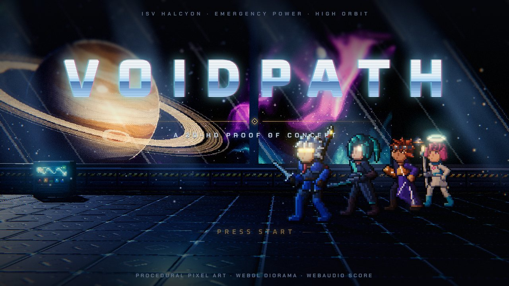
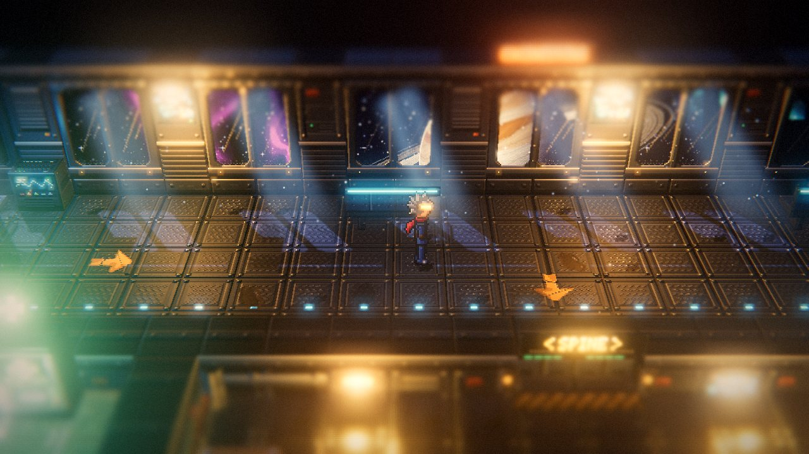
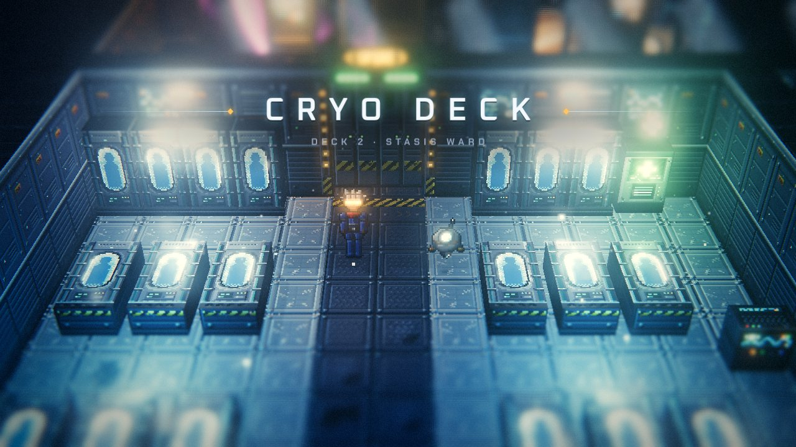
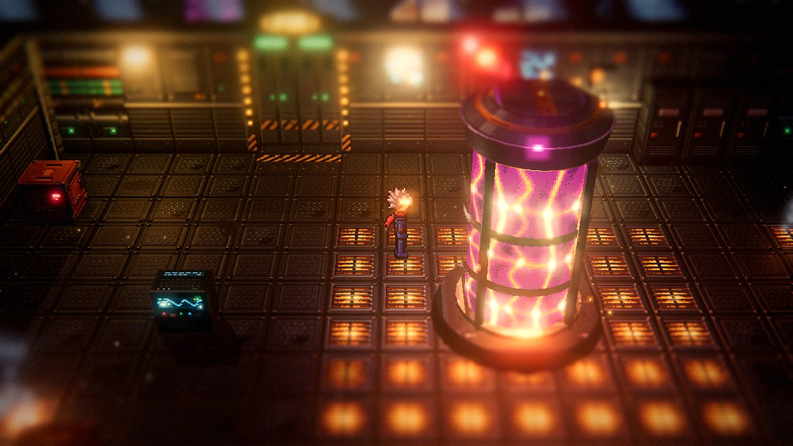
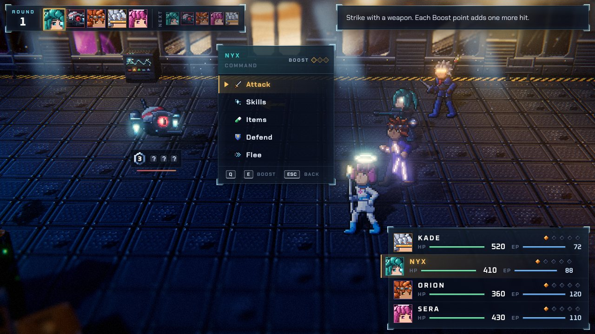
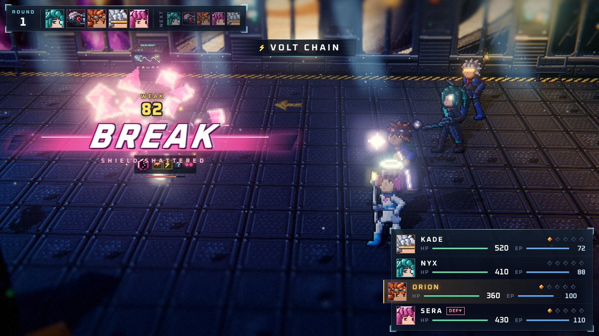
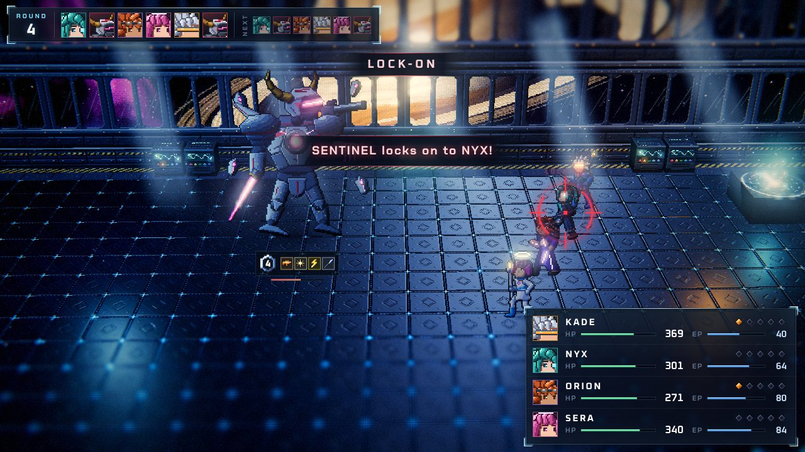
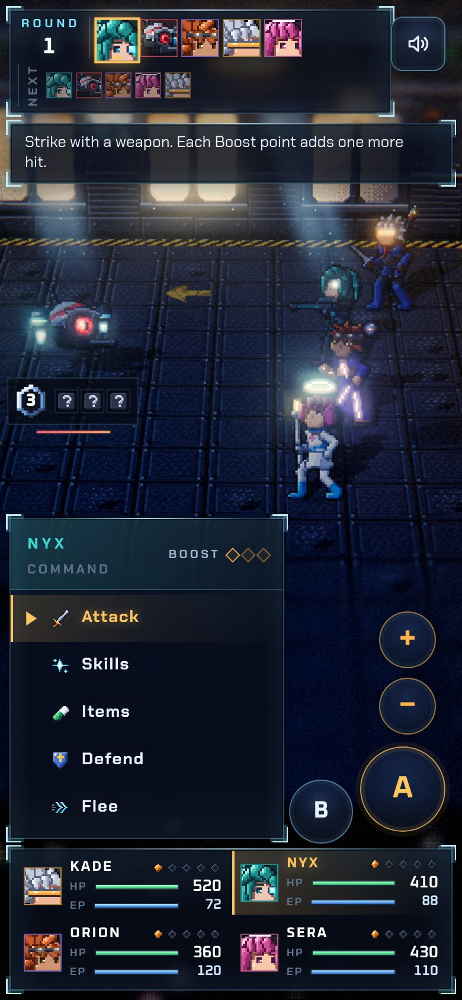

# VOIDPATH

A 2D-HD sci-fi RPG proof of concept in the style of *Octopath Traveler*: pixel-art sprites and
pixel-art textures standing in a real, lit 3D diorama, with tilt-shift depth of field, bloom and a
film grade, plus Octopath's Break/Boost turn-based battles.

Four travelers wake aboard the derelict colony ship **ISV Halcyon**, drifting on emergency power above
a ringed gas giant. Walk the Cryo Deck, the Spine Corridor and the Engineering Bay, find the Bridge
Keycard, and face the **SENTINEL** on the Observation Bridge.

Play online: (link added on publish)

| | |
|---|---|
|  |  |
|  |  |
|  |  |
|  |  |

Screenshots come from headless Chromium (software rendering); every pixel is generated at runtime.

## Play

| Action | Keyboard | Gamepad | Touch |
|---|---|---|---|
| Move / navigate menus | Arrows / WASD | D-pad / left stick | Virtual stick |
| Confirm / talk / open | Enter / Space / Z | A | A button, or tap a menu row |
| Cancel / back | Esc / X / Backspace | B | B button |
| Pause menu (field) | Tab / C | Start / Y | Menu button |
| Boost + / − (battle) | E / Q (also ] / [) | RB / LB | + / − buttons |
| Run (field) | Shift | X | Push the stick all the way |
| Speed up enemy turns (battle) | Hold Enter | Hold A | Hold A |
| Mute | M | | Sound button |

**In the field.** Walk up to people, terminals, crates and doors; a prompt shows what Confirm does.
Med-Stations restore the squad and log a checkpoint (Game Over sends you back to the last one).
In the corridor and the engineering bay, the danger gauge in the corner fills as you walk, and a
random encounter shatters the screen into a battle. The pause menu shows the party, lets you use
items, and has settings (sound, volumes, graphics quality) and a controls page.

**In battle.** Everyone acts once per round in speed order; the turn bar shows this round and the next.

- **Shields and weaknesses.** Every enemy carries a shield count and 2 to 4 hidden weaknesses ("?").
  Each hit of a type it is weak to (a weapon: blade, lance, rifle, gauntlet, or an element: thermal,
  cryo, volt, photon, void) reveals that weakness and knocks off one shield point.
- **Break.** At zero shield the enemy is **BROKEN**: it loses its next actions, takes double damage,
  and recovers a round later. Find the weaknesses, break, then unload.
- **Boost.** Each traveler gains 1 BP per round (max 5) unless they boosted the round before. Spend up
  to 3 BP before acting (E / RB / +): a boosted attack hits 1 + Boost times, a boosted skill hits
  harder or heals more. Multi-hit boosted attacks are the fastest way to strip a shield.
- **Defend** halves damage until your next turn and moves you to the front of the next round.
  **Flee** works in normal fights (70%), never against the boss.
- The SENTINEL acts twice a round, locks on to one traveler a round before firing its Annihilator
  Beam, and comes back from each Break with a bigger shield. Rest at the antechamber Med-Station first.

## Run it

The game is one self-contained page. Open `dist/index.html` in a recent desktop or mobile browser
(three.js loads from the jsdelivr CDN; everything else is inline). To build it yourself:

```
npm install
npm run build          # minified: dist/index.html and dist/artifact.html (the same bundle as a fragment)
npm run build:dev      # readable bundle
npm test               # battle rules and game state unit tests (node --test)
npm run scenarios      # end-to-end scripted runs in headless Chromium (needs a global Playwright)
```

`dist/tools/*.html` are per-module preview pages (engine, vfx, tiles, characters, enemies, UI, audio,
world, battle) built from `src/tools/`.

Graphics quality (low / medium / high) is in the pause menu's settings and is remembered; touch devices
start on medium. `dist/index.html?q=low` forces a level for one visit.

## How the 2D-HD look is made

- **Pixel art everywhere.** Every texture and sprite is painted procedurally in code at 32 texels per
  world unit, nearest-filtered, so it stays crisp at any resolution (`src/art/`).
- **Lit sprites.** Characters are planes in 3D that lean back toward the camera. Each sprite sheet gets an
  auto-generated normal map, so coloured point lights rim-light the pixel art the way HD lighting would,
  and emissive pixels (visors, LEDs, screens, energy cores) glow.
- **A miniature diorama.** A narrow-FOV camera looks down at the ship from about 34°; walls in front of
  the player sink to cutaway height so the rooms read like a model on a table.
- **Lights and atmosphere.** One shadow-casting "planet light" pours through the windows, with window
  shaped pools on the floor and volumetric light shafts, plus amber work lamps, a pulsing reactor, a
  rotating alarm light, fog, dust, frost, steam and sparks.
- **Lens and grade.** The post chain is bloom, a two-pass tilt-shift blur that keeps a horizontal band
  around the player sharp (the signature Octopath effect), ACES tone mapping, then a grade with
  vignette, split toning, film grain and slight chromatic aberration (`src/core/postfx.js`).
- **Juice.** Glass-shatter encounter transitions, hit-stop and screen shake on Breaks, and stacked
  damage numbers.

All art, the music (title, exploration, battle, boss, victory) and every sound effect are procedural:
painted or synthesised at runtime with no image or audio files.

## Project structure

```
src/
  main.js               boot: engine, input, audio, UI, art prebuilt behind the loading screen, debug hooks
  core/
    game.js             state machine (title / explore / battle) and the flows between them
    titleScene.js       the 3D title backdrop (the travelers on the observation deck)
    engine.js, postfx.js            renderer, post FX chain, transitions (shatter / fade / iris)
    spriteActor.js, particles.js, vfx.js   lit pixel sprites, particles, glows, light shafts
    audio.js            procedural WebAudio music and sound effects
    input.js            keyboard, gamepad and touch input
    state.js            party, inventory, flags, checkpoint and stats
  art/                  procedural pixel art: party, enemies, icons, tiles, effects
  ui/                   DOM UI: dialog, HUD, pause menu, title, game over / complete screens
  world/                the ship map, diorama builder, lighting, props, player and ExploreState
  battle/               rules (data.js, model.js) and presentation (stage, arena, director, battleUI)
  tools/                preview pages, one per module
tests/                  unit tests (node --test) and tests/scenarios/*.json end-to-end runs
tools/play.mjs          headless runner + screenshot tool (Playwright, SwiftShader)
tools/scenarios.mjs     runs every scenario with play.mjs --strict
build.mjs               esbuild bundle inlined into dist/*.html
```

`window.__VP` exposes debug hooks for tests: `__VP.debug.skipTitle()`, `startBattle(id, { seed })`,
`teleport(x, z)`, `view(name)`, `winBattle()`, `setQuality(q)`, `state()` and a few more (see `src/main.js`).

Built with three.js r170 and esbuild. Fonts: Oxanium, Chakra Petch and Silkscreen (Google Fonts).
